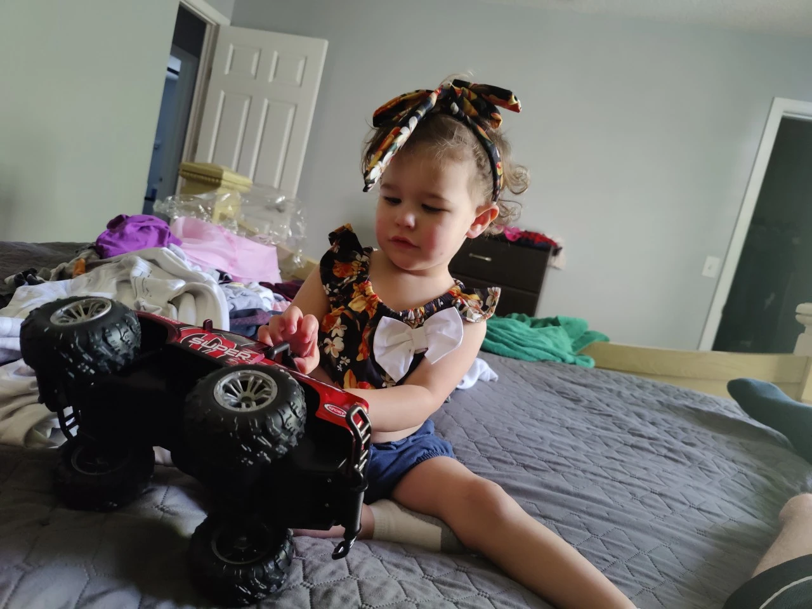
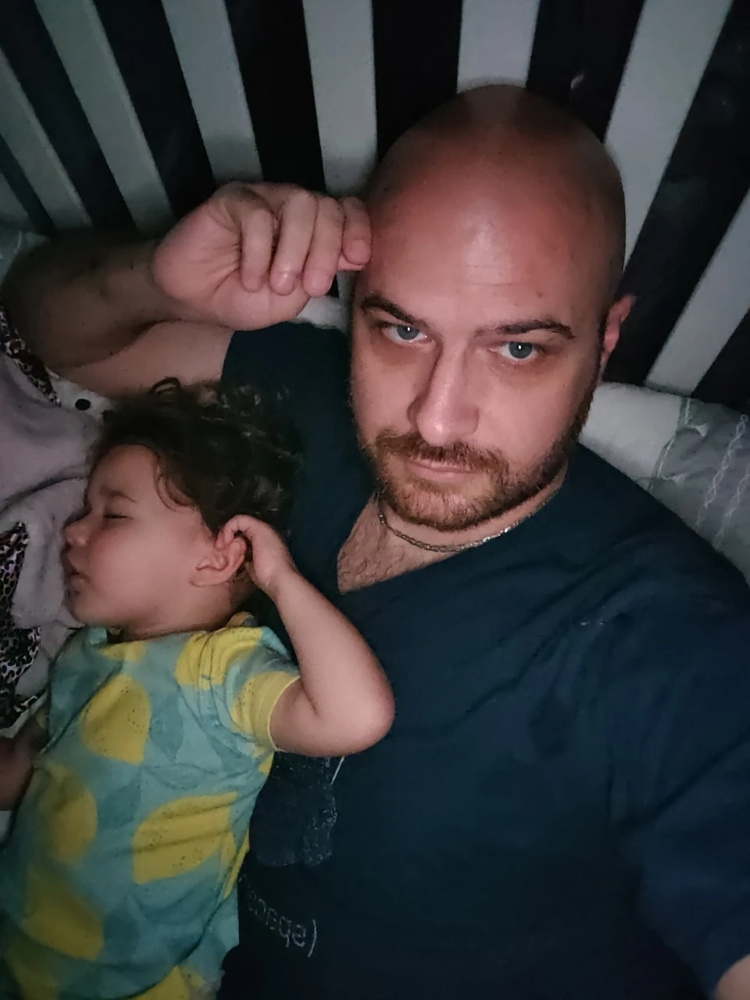
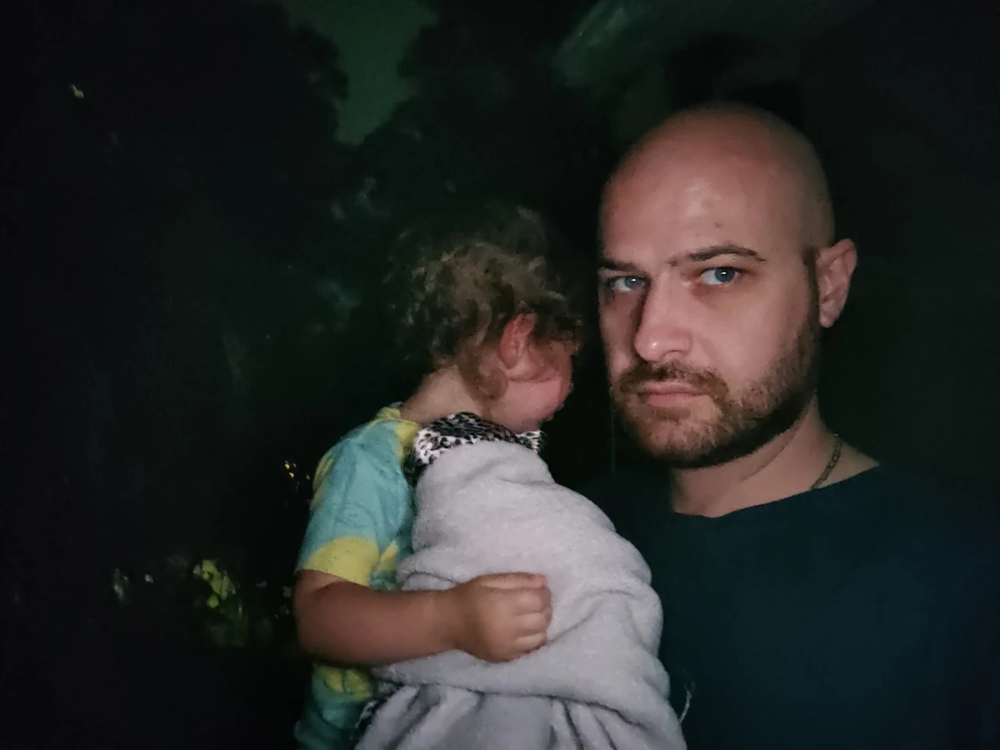
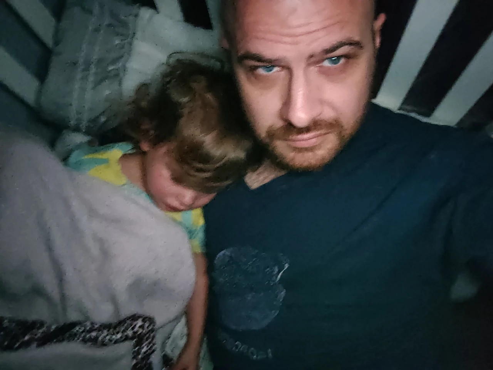
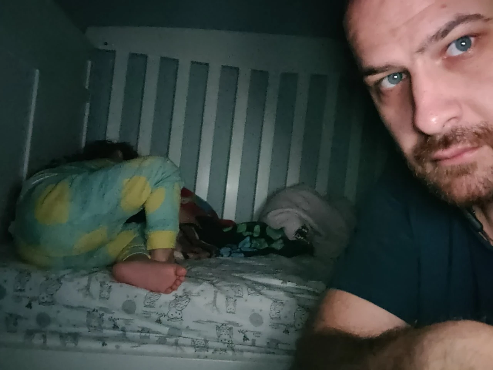

#+TITLE: April  1, 2024
#+INCLUDE: ~/org/blog/noumena/header.org
#+INCLUDE: ~/org/blog/image-preview-header.org

#+HTML_HEAD_EXTRA:<meta property="og:image" content="https://joshua-wood.dev/noumena/2024/april/01/">
#+HTML_HEAD_EXTRA:<meta property="og:image:alt" content="April  1, 2024 alt"/>
#+HTML_HEAD_EXTRA:<meta property="og:description" content="">
#+HTML_HEAD_EXTRA:<meta name="twitter:image" content="https://joshua-wood.dev/noumena/2024/april/01/" />

* Video

#+begin_export html

<iframe width="1870" height="728" src="https://www.youtube.com/embed/P_AkHj-khAU" title="Helping Daddy Drive" frameborder="0" allow="accelerometer; autoplay; clipboard-write; encrypted-media; gyroscope; picture-in-picture; web-share" referrerpolicy="strict-origin-when-cross-origin" allowfullscreen></iframe>

#+end_export

* Photo

#+begin_export html

    &#x1F4E7; <!-- Share Icon -->

#+end_export
