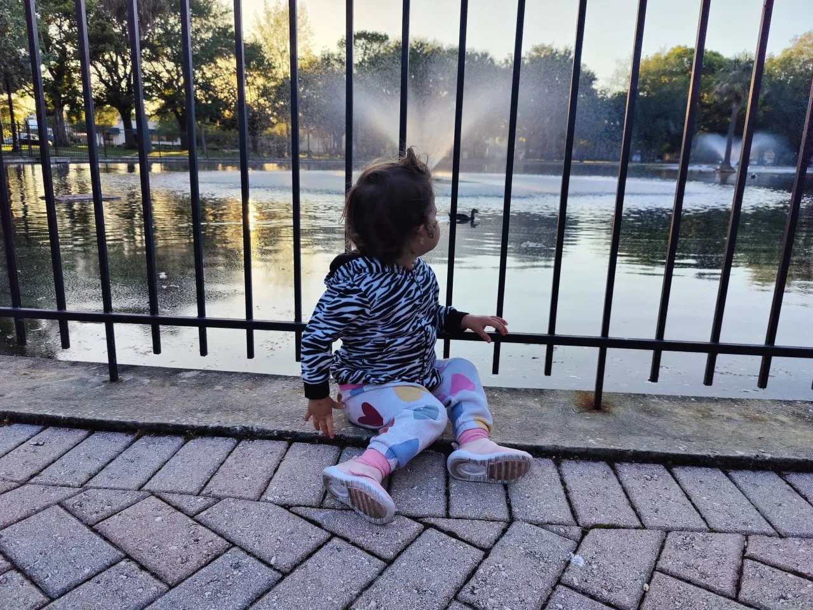
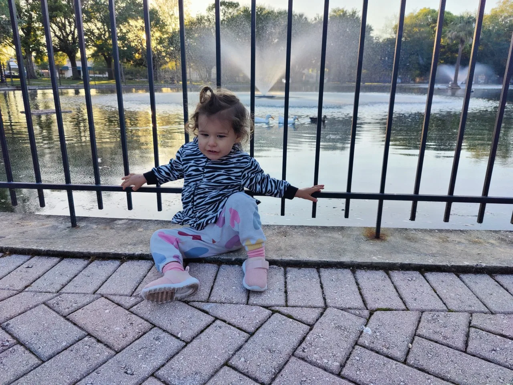
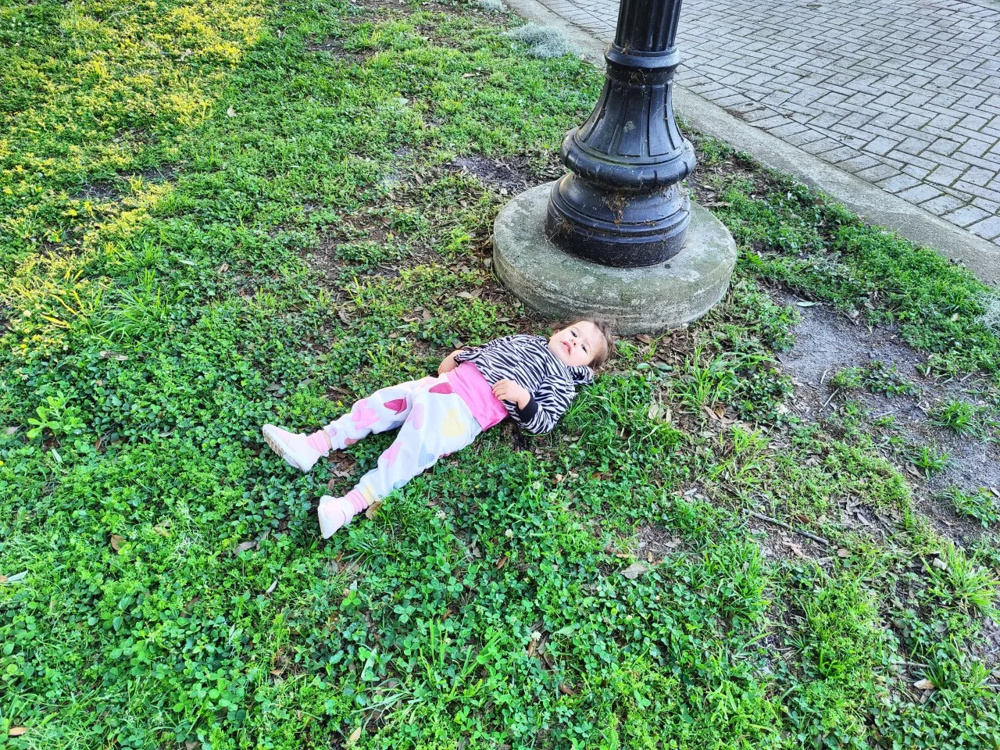
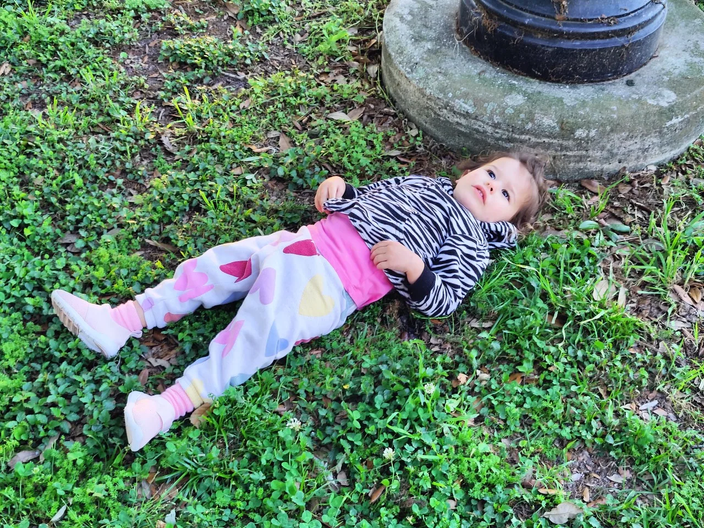
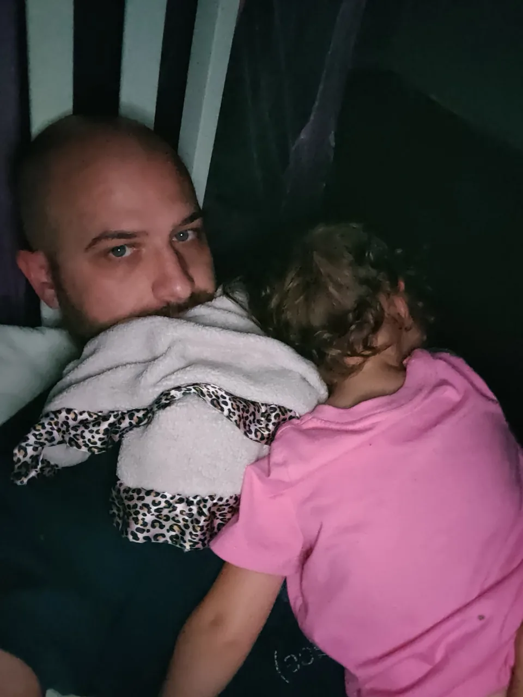
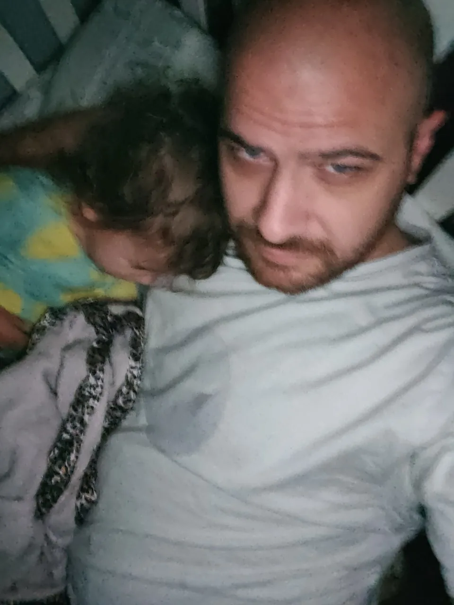
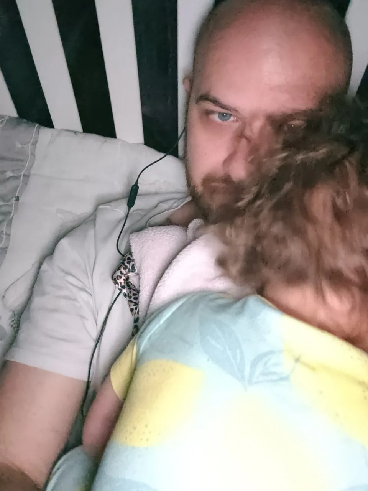
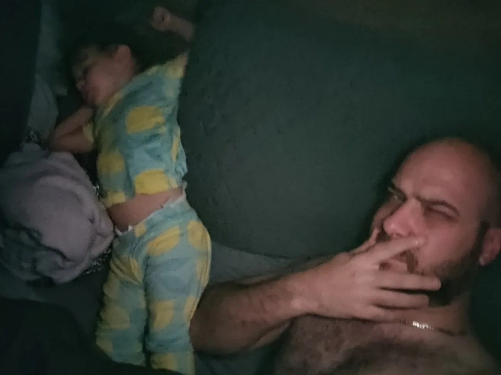

#+TITLE: April  4, 2024
#+INCLUDE: ~/org/blog/noumena/header.org
#+INCLUDE: ~/org/blog/image-preview-header.org

#+HTML_HEAD_EXTRA:<meta property="og:image" content="https://joshua-wood.dev/noumena/2024/april/04/">
#+HTML_HEAD_EXTRA:<meta property="og:image:alt" content="April  4, 2024 alt"/>
#+HTML_HEAD_EXTRA:<meta property="og:description" content="">
#+HTML_HEAD_EXTRA:<meta name="twitter:image" content="https://joshua-wood.dev/noumena/2024/april/04/" />

* Riverside Park

#+begin_export html

<iframe width="1885" height="712" src="https://www.youtube.com/embed/HNCvjjMemBU" title="Duck Pond At Riverside Park" frameborder="0" allow="accelerometer; autoplay; clipboard-write; encrypted-media; gyroscope; picture-in-picture; web-share" referrerpolicy="strict-origin-when-cross-origin" allowfullscreen></iframe>

#+end_export

#+begin_export html

<iframe width="1905" height="712" src="https://www.youtube.com/embed/Bi-mTjNjYAY" title="Throwing Stuff In Riverside Park Duck Pond" frameborder="0" allow="accelerometer; autoplay; clipboard-write; encrypted-media; gyroscope; picture-in-picture; web-share" referrerpolicy="strict-origin-when-cross-origin" allowfullscreen></iframe>

#+end_export

* Bed Time

