#+TITLE: March  2, 2024
#+INCLUDE: ~/org/blog/noumena/header.org
#+INCLUDE: ~/org/blog/image-preview-header.org

#+HTML_HEAD_EXTRA:<meta property="og:image" content="https://joshua-wood.dev/noumena/2024/march/02/">
#+HTML_HEAD_EXTRA:<meta property="og:image:alt" content="March  2, 2024 alt"/>
#+HTML_HEAD_EXTRA:<meta property="og:description" content="">
#+HTML_HEAD_EXTRA:<meta name="twitter:image" content="https://joshua-wood.dev/noumena/2024/march/02/" />

* Good Morning, Noumena!

#+begin_export html

<iframe width="1885" height="713" src="https://www.youtube.com/embed/ggEpOIWFZtw" title="Going Wild To Clowncore Safe" frameborder="0" allow="accelerometer; autoplay; clipboard-write; encrypted-media; gyroscope; picture-in-picture; web-share" allowfullscreen></iframe>

#+end_export

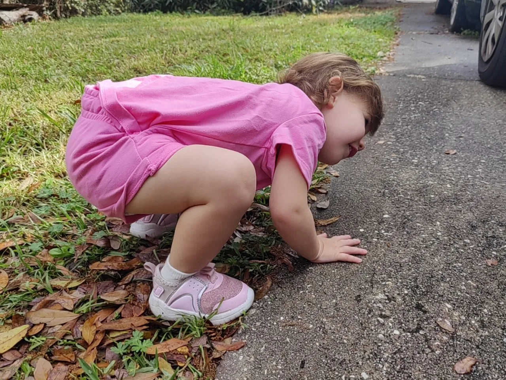

#+begin_export html

<iframe width="1870" height="713" src="https://www.youtube.com/embed/jVIjdoaQ1yE" title="Hanging Out In The Yard" frameborder="0" allow="accelerometer; autoplay; clipboard-write; encrypted-media; gyroscope; picture-in-picture; web-share" allowfullscreen></iframe>

#+end_export

* Story Time

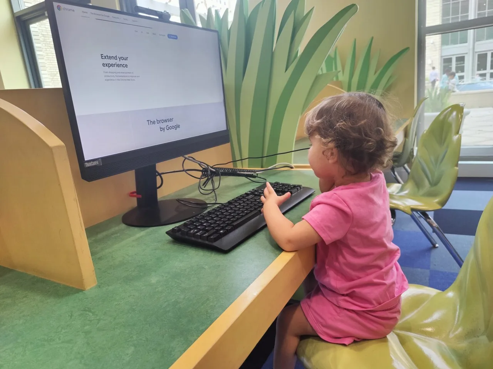

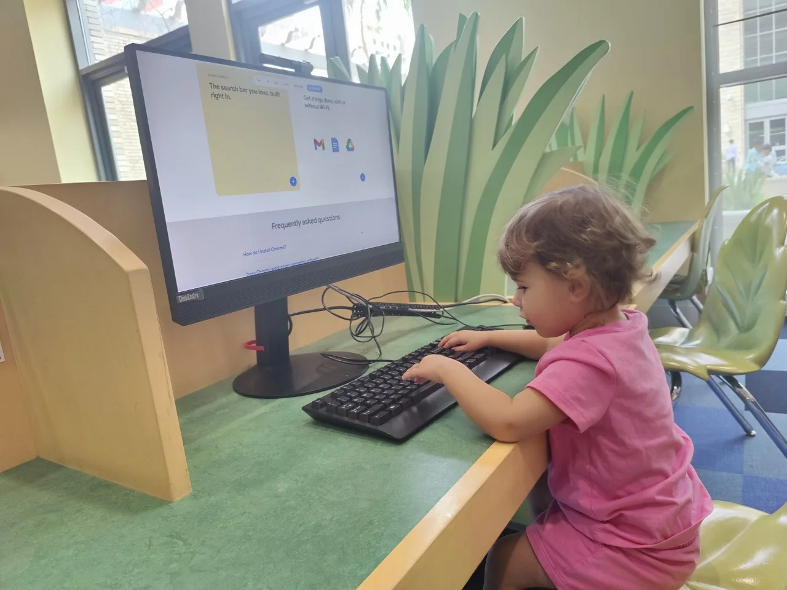

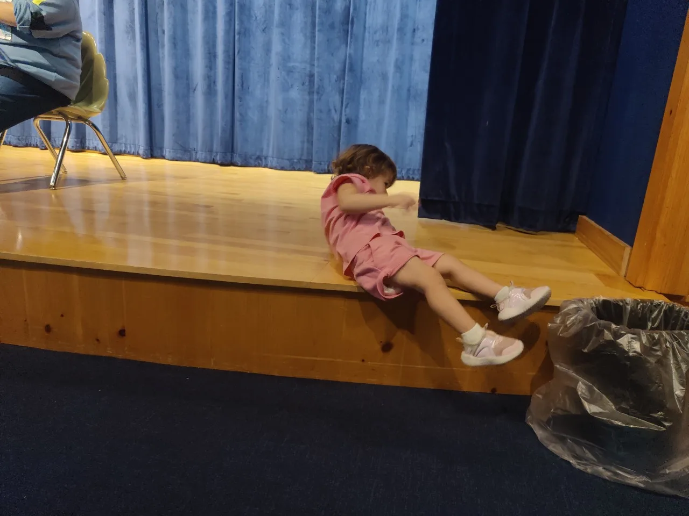

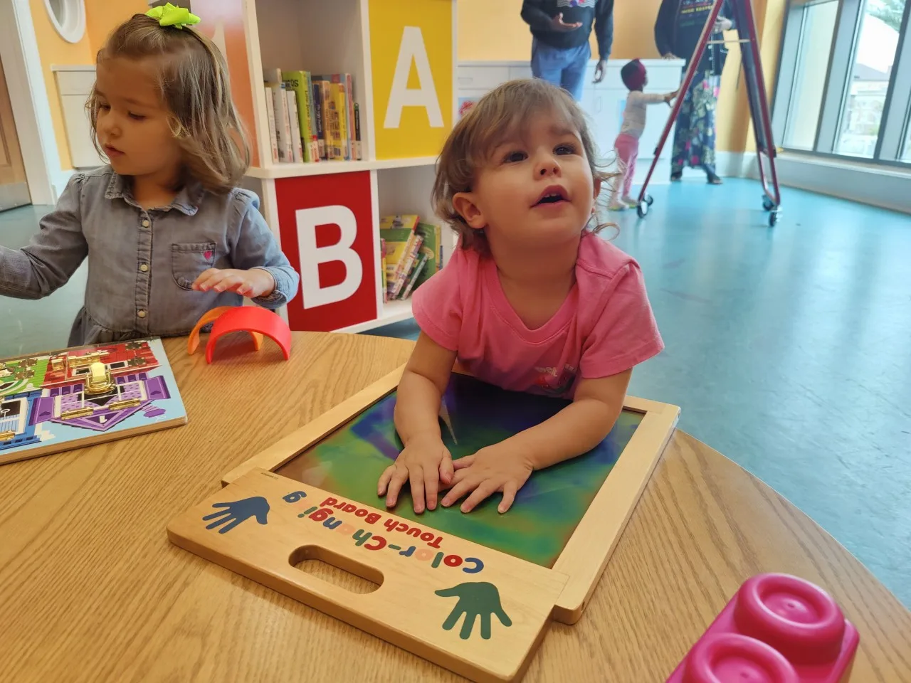

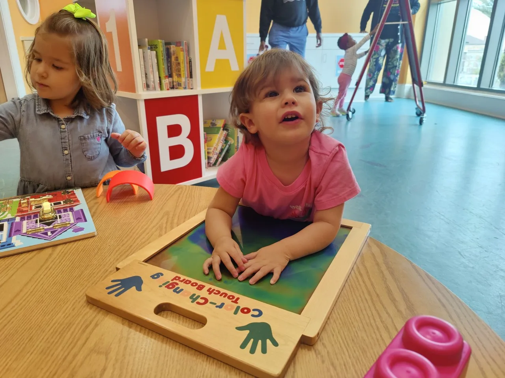

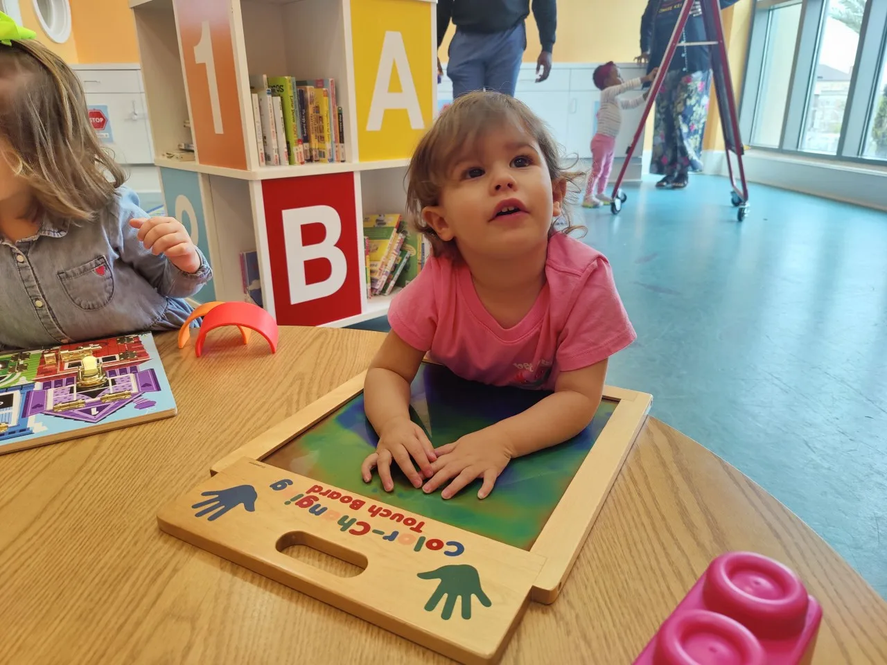

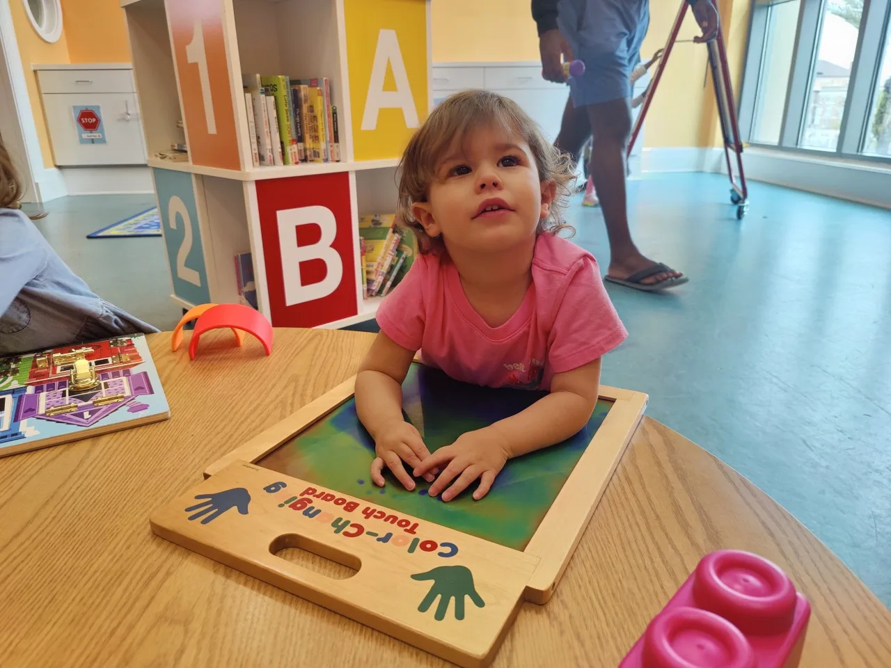

#+begin_export html

<iframe width="1885" height="713" src="https://www.youtube.com/embed/OlPRvCNAyoM" title="Playing In Library Playroom" frameborder="0" allow="accelerometer; autoplay; clipboard-write; encrypted-media; gyroscope; picture-in-picture; web-share" allowfullscreen></iframe>

#+end_export

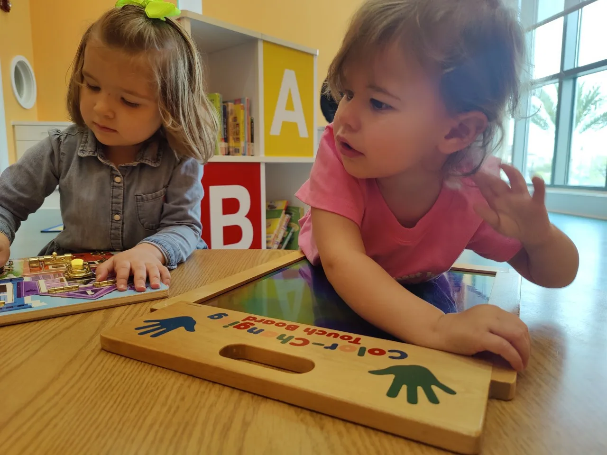

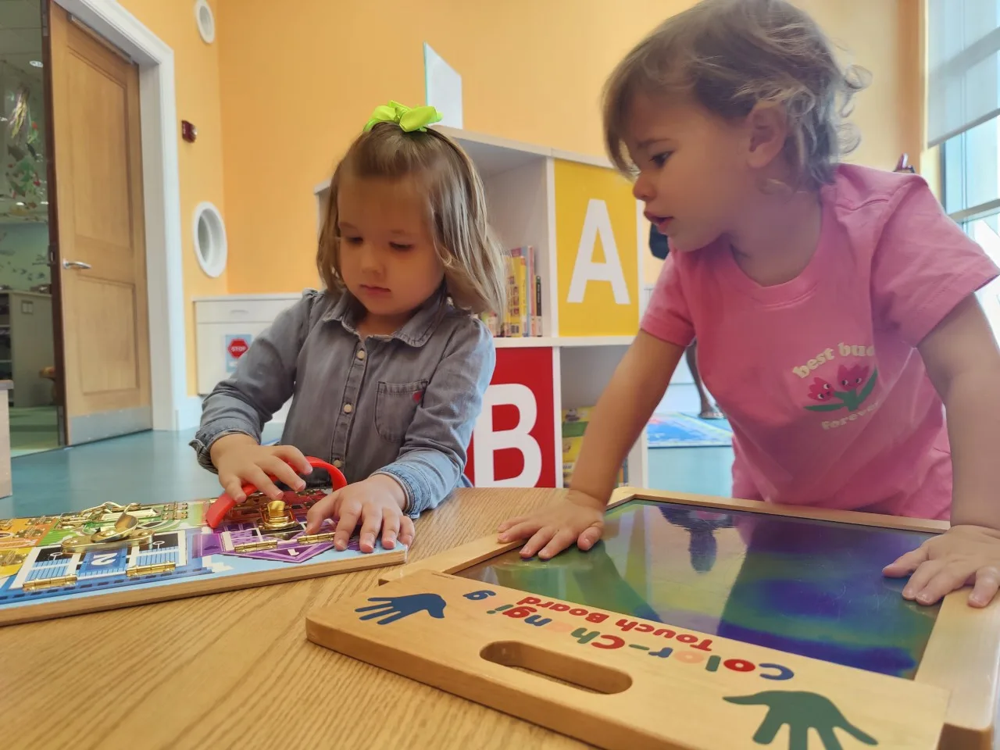

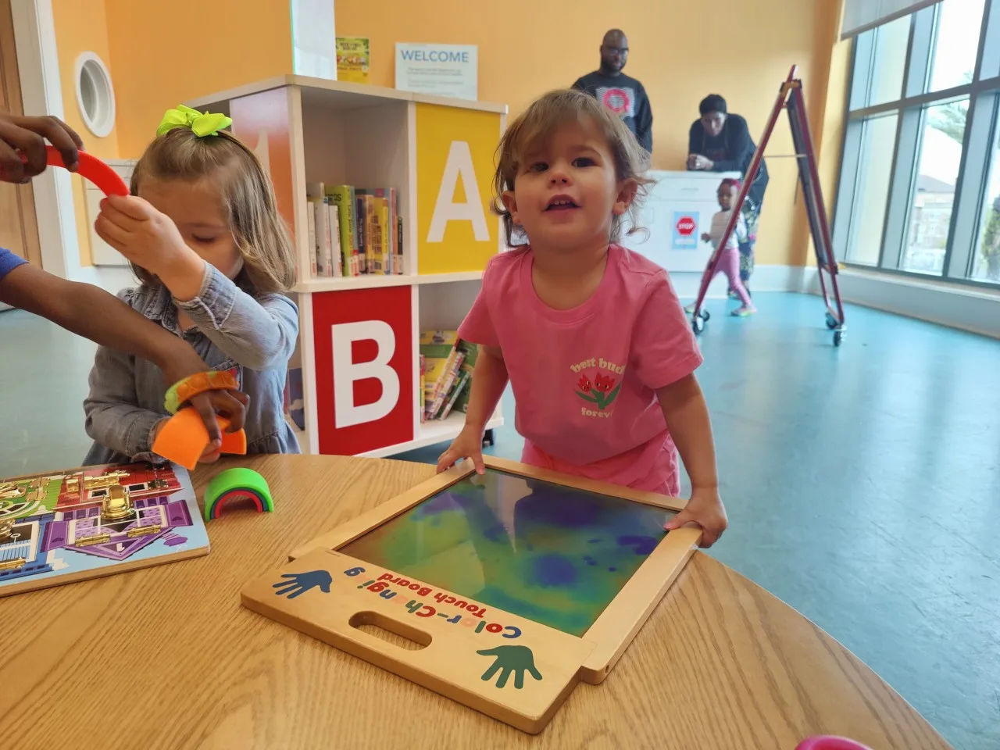

* Lunch

#+begin_export html

<iframe width="1870" height="729" src="https://www.youtube.com/embed/DlyFVIfcD6w" title="Running By Our Reflection" frameborder="0" allow="accelerometer; autoplay; clipboard-write; encrypted-media; gyroscope; picture-in-picture; web-share" allowfullscreen></iframe>

#+end_export

* Nap Time (Or Lack Thereof)

#+begin_export html

<iframe width="1870" height="713" src="https://www.youtube.com/embed/bHgns1MhpHM" title="Refusing To Go To Sleep" frameborder="0" allow="accelerometer; autoplay; clipboard-write; encrypted-media; gyroscope; picture-in-picture; web-share" allowfullscreen></iframe>

#+end_export

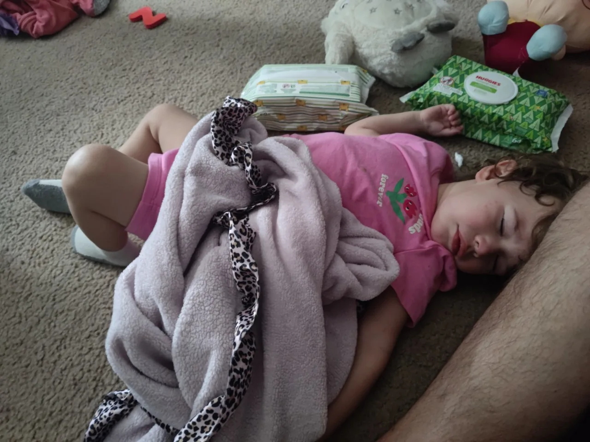

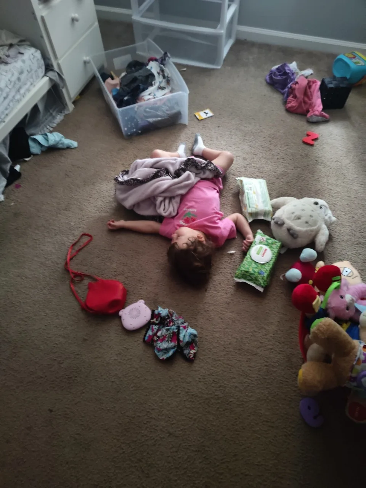

* Dinner

#+begin_export html

<iframe width="1870" height="713" src="https://www.youtube.com/embed/3D4OI_5eupI" title="Eating Daddys Dinner" frameborder="0" allow="accelerometer; autoplay; clipboard-write; encrypted-media; gyroscope; picture-in-picture; web-share" allowfullscreen></iframe>

#+end_export

* Mommy Visits

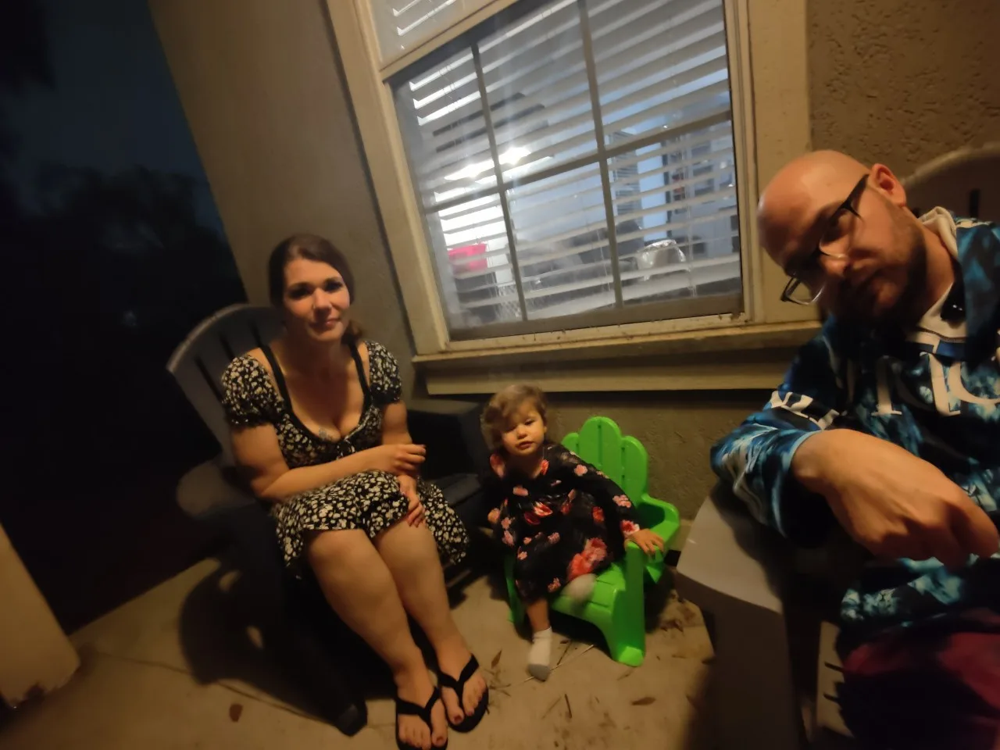
