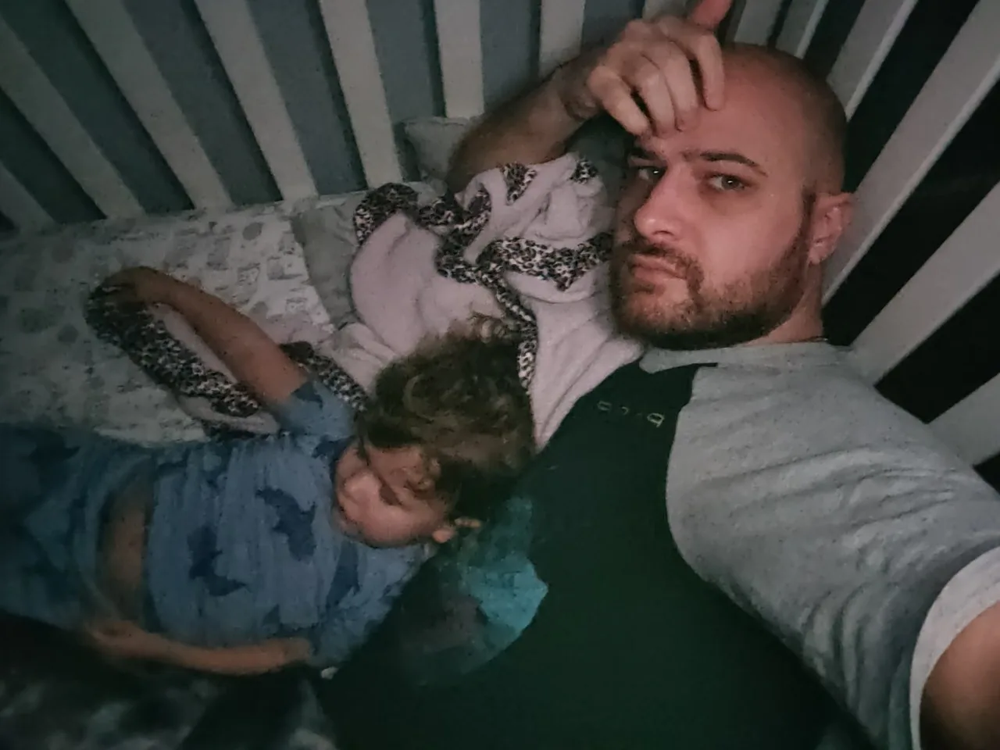

#+TITLE: March  5, 2024
#+INCLUDE: ~/org/blog/noumena/header.org
#+INCLUDE: ~/org/blog/image-preview-header.org

#+HTML_HEAD_EXTRA:<meta property="og:image" content="https://joshua-wood.dev/noumena/2024/march/05/photo/falling-asleep-on-daddy-preview.jpg">
#+HTML_HEAD_EXTRA:<meta property="og:image:alt" content="March  5, 2024 alt"/>
#+HTML_HEAD_EXTRA:<meta property="og:description" content="">
#+HTML_HEAD_EXTRA:<meta name="twitter:image" content="https://joshua-wood.dev/noumena/2024/march/05/photo/falling-asleep-on-daddy-preview.jpg" />

* Photo

* Videos

#+begin_export html

<iframe width="1879" height="689" src="https://www.youtube.com/embed/C_WcktgmfUI" title="Singing Disney Songs 1" frameborder="0" allow="accelerometer; autoplay; clipboard-write; encrypted-media; gyroscope; picture-in-picture; web-share" referrerpolicy="strict-origin-when-cross-origin" allowfullscreen></iframe>

#+end_export

#+begin_export html

<iframe width="1879" height="689" src="https://www.youtube.com/embed/nvwe_HaoREw" title="Singing Disney Songs" frameborder="0" allow="accelerometer; autoplay; clipboard-write; encrypted-media; gyroscope; picture-in-picture; web-share" referrerpolicy="strict-origin-when-cross-origin" allowfullscreen></iframe>

#+end_export
