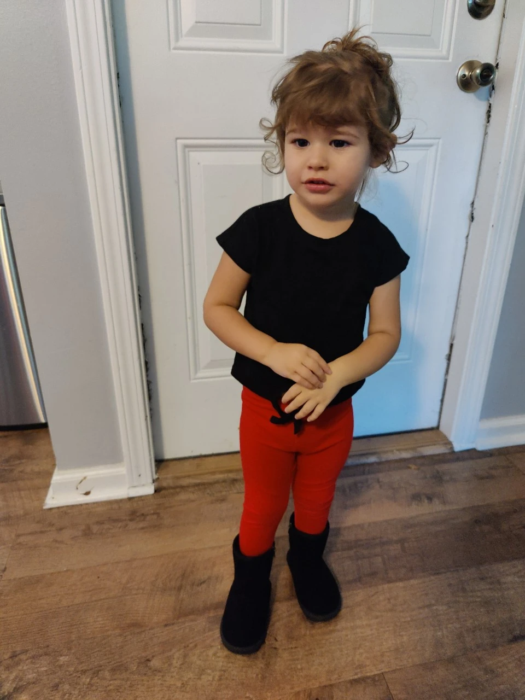
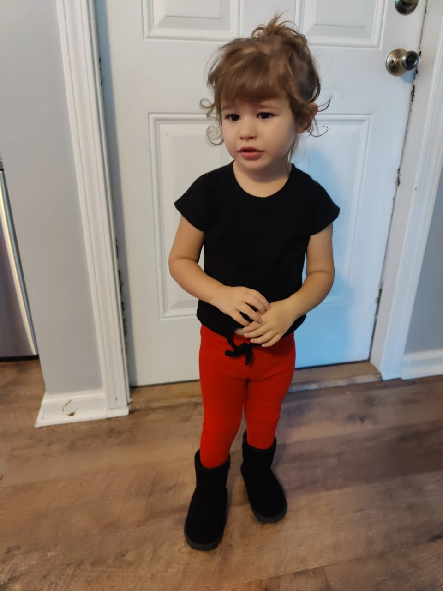
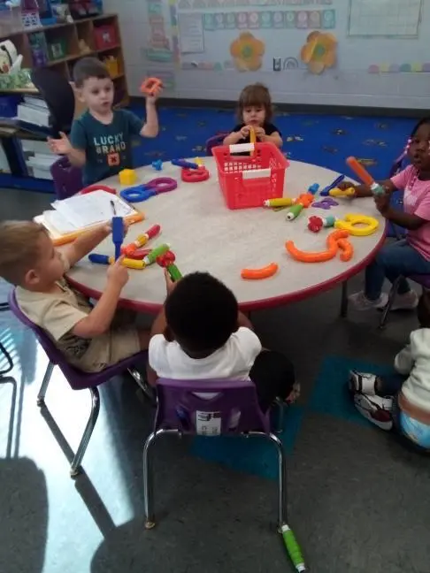
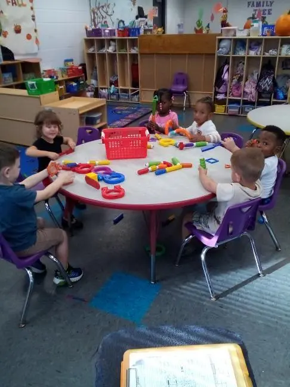
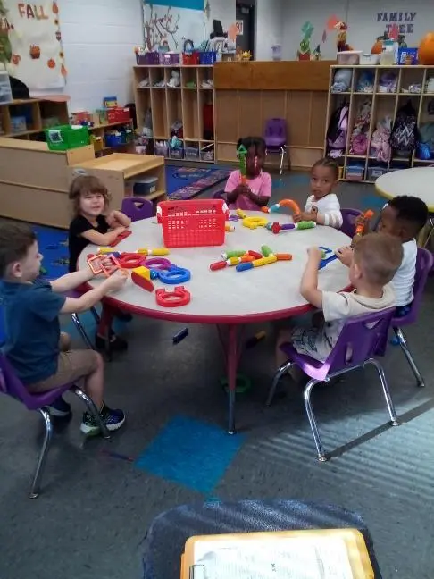

#+TITLE: October 22, 2024
#+INCLUDE: ~/org/blog/noumena/header.org
#+INCLUDE: ~/org/blog/image-preview-header.org

#+HTML_HEAD_EXTRA:<meta property="og:image" content="https://joshua-wood.dev/noumena/2024/october/22/new-outfit-preview.webp">
#+HTML_HEAD_EXTRA:<meta property="og:image:alt" content="October 22, 2024 alt"/>
#+HTML_HEAD_EXTRA:<meta property="og:description" content="">
#+HTML_HEAD_EXTRA:<meta name="twitter:image" content="https://joshua-wood.dev/noumena/2024/october/22/new-outfit-preview.webp" />

* Morning

This morning, Noumena was awoken by Mommy leaving Daddy a little extra time to sleep. Mommy made Noumena a bagel for breakfast and me one as well. From the look of it, Noumena ate about half the bagel. Not bad.

Mommy got Noumena dressed in a cute outfit and we had a few minutes as I started my work day to play around. When I closed my door and began working, Noumena was upset crying at the door for Daddy. Of course, I opened the door to her. She wanted hugs before she went anywhere. She was still upset and ended up taking off her boots. Mommy felt Noumena's feet and concluded that the boots were too warm to keep her in,so we opted for her black shoes instead.

I took Noumena to Mommy's car. Before we said our goodbyes, Noumena insisted on multiple hugs eventually letting me go allowing Mommy to take her to daycare and me to begin my work day.

* Daycare

* Pickup

All the front classrooms were empty as I entered the daycare. Reaching Noumena's room, she noticed me immediately. She always plays hard to get whenever I pick her up from daycare. I'm not sure what it's supposed to signify, but I had a trick up my sleeve this time. She noticed me while she was seated on the carpet, so I covered my face with my hands, and, whenever she looked away, stepped closer. As I approached, she would shake her head back and forth every time I revealed my face from behind my hands. I grew closer as she shook her head only stopping to cover my face when her eyes met mine. At some point while the teacher was talking to me about parent teacher conferences, she stood up and ran to get her blanky. I quickly concluded my conversation with her teacher and guided Noumena out the front doors as she chased me only stopping to point at the dark rooms telling me that they were dark: a fact which, of course, I confirmed with her.

Exiting the daycare, I began leading Noumena to the car. She stopped on the sidewalk to investigate the fallen acorns. I informed her what they were, but then she noticed an ant and screamed pointing at it and telling me it was an ant! I told her to just step away and the and wouldn't bother her. Asking several times for her to please give me her hand so I could lead her to the car, she refused as she walked through the grass picking up a stick and letting me know that she wanted to bring it with her.

Once Noumena and I reached the car, I asked her kindly to get in. Often, she ignores my first request. At the end of my second request I offered her an ultimatum: either she'd get in the car willingly or I'd put her in the car. Once the ultimatums are on the table, she usually swiftly complies. Noticing the remnants of a bag of Kix cereal we'd left in the car, Noumena tells me she wants Kix. Concerned about her eating a substantive dinner, I tell her that after dinner I'll give her Kix if she still really wants them. It takes a couple times uttering this point, but she eventually concedes. I then buckle her in while she insists on clipping the car-seat straps together. I always allow her to only gently guiding the placement of the clips for her to fasten them together herself.

With Noumena tightly bucked in, we're off! She's a lot better than she used to be at car rides. There's not much fuss these days. Except today, and thankfully at a red light, she's trying to remove her shoes. The buckle on her shoes, though simple, is still a little too complex for her to easily do it herself, so as she struggles to get her shoes off, eventually she becomes overwhelmed and yells for help. I get her to ask me nicely to take her shoes off and once she does I unbuckle them allowing her to remove them herself. We were listening to music and as we crossed over the Matthew's bridge and she yelled that she didn't want to listen to music anymore. Once again, I get her to ask nicely to turn it off. She does, and so I turn it off. We spend most of the rest of the car ride playing a game where she covers herself with her blanket saying, "you can't get me!" to which I always respond by reaching my hand back and grabbing her face through the blanket.

* Dinner (Noumena's First Burn)!

I told Noumena that I was going to cook Chick'n nuggets for dinner. She agreed to it initially, but of course opening the freezer and seeing the popsicles we'd gone to Publix specifically to buy at her request, that was all she wanted. I told her that I would get her one after dinner, but insisted that she eat a substantial meal first. She didn't take too kindly to this suggestion and started throwing a mini tantrum, hiding herself underneath the sink in the cupboards. Tantrums ending in her hiding are usually very easy to handle as when I pretend I don't know where she is turning them into a game, she's normally befallen with happiness. We play while the oven preheats. I asked her to help me get the tray ready to put in the oven, something she contested, instead pulling down the aluminum foil I used to cover the tray ripping a small chunk off. I inform her that's not a toy and that she can put it back for me, but she's not allowed to pull out any more foil. Begrudgingly, Noumena decides to put the foil back in the correct drawer after making an attempt at the silverware drawer.

After placing the aluminum foil back, Noumena wants to be seated on the counter, attempting to whine to get her way. Whenever she whines, I just tell her exactly how I'd like to be addressed. "Daddy... will you.... please.... pick me up!" Often, my first attempt is successful in getting her to reform, but this time it took a couple tries. Eventually, Noumena relents from the whining and asks nicely to be put on the counter. I finish placing the Chik'n nuggets on the tray and place them in the oven as Noumena looks on. When finished, she grabs various things on the counter asking "What's that?" first the pepper grinder and then the salt. When she asks about the pepper, I tell her what it is, but when she asks what the salt is, I repeat her question back to her. She already knows. I don't know why she asks about things she already knows, but she often does. She, of course, immediately answers salt and I persuade her off the kitchen counter.

Walking by the oven, Noumena tells me not to touch it because it's hot. I want to make sure she understands the gravity of the oven being hot so as she walks passed it, I ask if she wants to feel the heat. She does. I crack the oven open and tell her not to touch it. She reaches her hand close, but not close enough to really feel the heat. In attempt to guide her hand closer in a very controlled manner, I reach for it to guide it in. She evades my grasp and as I tell her it's very important not to touch specific parts pointing towards the oven rack. Just then and more quickly than my reflexes, she reaches out her middle and ring finger touching the oven rack, pulls away immediately and starts crying! Within seconds I've picked her up and am standing at the sink, Noumena in my arms, running her freshly burned fingers under the cool water. I'm sure this provides a lot of relief because in under a minute she's stopped crying. I take this opportunity to drill in why she needs to listen carefully when Daddy tells her not to touch something that's really hot because even worse than the pain she's endured could happen to her again!

Looking on my phone for mild burn remedies as I know I don't have any burn ointment, I find that for mild burns it's appropriate to apply Vaseline, so I decide that's what I'll do. I take Noumena to the bathroom where the Vaseline is and bring it with us to the kitchen table to set her on it and apply it as well as two child-sized bandages that despite their namesake are too large for her tiny little fingers. Nevertheless, after applying the bandages, Noumena thanks me for taking care of her. These words are the light of my life and my reason for being. There is nothing better in this world than your child realizing your love for them.

Once she's ready to go, I prepare our plates to begin eating, cutting her nuggets into quarters so that they cool faster. Thankfully, she was burned on her left hand leaving her right, dominant hand unscathed and ready to shovel in Chik'n nuggets.

#+begin_export html

<iframe width="1870" height="728" src="https://www.youtube.com/embed/vPy0uHNpKxM" title="Tough From Burning Fingers" frameborder="0" allow="accelerometer; autoplay; clipboard-write; encrypted-media; gyroscope; picture-in-picture; web-share" referrerpolicy="strict-origin-when-cross-origin" allowfullscreen></iframe>

#+end_export

Shortly after dinner, true to my word, I tell Noumena I've got a surprise for her and head to the freezer to remove the box of popsicles. I let her choose both of our popsicles and she chooses a strawberry one for both of us. Excellent choice. Ever since our first time eating popsicles together, she prefers to eat them on the couch with me just as we did our first time, so we venture to the couch, sit down and begin eating together.

#+begin_export html

<iframe width="1885" height="712" src="https://www.youtube.com/embed/ZmxHJhucFJc" title="Cheers With Popsicles" frameborder="0" allow="accelerometer; autoplay; clipboard-write; encrypted-media; gyroscope; picture-in-picture; web-share" referrerpolicy="strict-origin-when-cross-origin" allowfullscreen></iframe>

#+end_export

* Neighborhood Walk

After finishing our popsicles, Noumena opts to read a book. I tell her I want to read /Where The Wildthings Are/ and she goes to look for it. Unfortunately, not finding it immediately, she gets frustrated and picks a different book. I'm happy to read whatever she wants to her, but the enthusiasm for book-reading is short-lived and we end up playing with her roller coaster toy instead. It's been so long since she's ridden it, she's now scared to do so instead opting to push it and just watch it go, returning it to the top of the slide to do it again.

Quickly, Noumena grows tired of doing this, but noticing that it's getting darker earlier these days, she thinks that the moon may be out. She informs me that she wants to get check if the moon is outside, so we put on her shoes and head out the door. We notice a few kids playing on a swing-set just down the street and go to join them. They agree to let us swing with them and we do for a little bit, but Noumena prefers going down the small slide in their front yard. We do this for maybe 10 minutes before the children who live at that house are told to come in and get ready for bed leaving us to adventure on our own.

* Tidewater Acres Park

I had initially planned on taking her to the park once we got outside to which she agreed, and when we could no longer play with the kids, we begin walking to the park. Noumena wants to get there fast, so I put her on my shoulders and begin running at her request.

Once we arrive, we notice two cats immediately. One is rummaging through the trashcan at the park and the other is on the playground. The one on the playground is covered in an orange and white coat and seems as though she will give us an opportunity to pet her. Noumena's zeal to pet the cat gets the best of her, however, and scares the cat off just as the cat is getting within touching distance of us. I try my best to coax the cat to come closer, but to no avail. Instead, we opt for sitting on the sidewalk encircling the playground and hope she eventually comes to us. This proves to be too much of a test of Noumena's patience and she tries walking closer to the cat inevitably scaring it further away. It's a shame, but I always make sure Noumena does her best to respect the wishes of animals.

Noumena does remember that she wanted to swing after only having done so briefly in the kids' yard, so she does eventually politely ask me to put her in the swing. I only give her two big pushes before she's done with the swing and decides to head home. We pause briefly to try to get closer to the other black and white cat still rummaging through the garbage. The cat, however, fleas and sadly never gives Noumena the opportunity to pet her. We then make our way home.

* Before Bed

The first thing Noumena is interested in once we get home is drinking soy milk. I tell her that first she needs to get dressed in her pajamas before she can to which she obliges with some difficulty. Maybe it's my fault for turning getting dressed in pajamas into a game so many times. Oh well, Noumena has lots of fun being difficult and I'll be damned if it doesn't make me proud that she's giving me a hard time.

Soy milk seems an odd request to me, because she's not usually that enthusiastic about it. I conclude it has to be the new brand I bought which is of course has more sugar in it as I only purchased it to accommodate the fact that they didn't sell the unsweetened kind. Nevertheless, she asks for multiple glasses, and I make sure she's abiding by her manners before I ever refill her cup.

#+begin_export html

<iframe width="1885" height="712" src="https://www.youtube.com/embed/Le3LfTpHfRQ" title="Learning To Be Polite" frameborder="0" allow="accelerometer; autoplay; clipboard-write; encrypted-media; gyroscope; picture-in-picture; web-share" referrerpolicy="strict-origin-when-cross-origin" allowfullscreen></iframe>

#+end_export

#+begin_export html

<iframe width="1885" height="712" src="https://www.youtube.com/embed/dHfmc4W4OMU" title="More Learning How To Be Polite" frameborder="0" allow="accelerometer; autoplay; clipboard-write; encrypted-media; gyroscope; picture-in-picture; web-share" referrerpolicy="strict-origin-when-cross-origin" allowfullscreen></iframe>

#+end_export

When Noumena's finished, I prompt her to watch TV before going to bed letting her know that there's only about 20 minutes she can watch before she has to brush her teeth and go to bed. I opted out of bath time tonight because of her burn. I reasoned that the warm water might aggravate it and that I didn't want the bandages coming off.

We watch content-slop for toddlers until 8:35pm when it's time to brush her teeth.

* Bed Time

When I turn off the TV, it's always a little bit of a struggle even though I give her ample warning when I'm about to including telling Noumena what song is the last song we're going to listen to. Despite her initial resistance, she's always quick to calm down and I can usually wrestle her into a good mood before she acquiesces to my suggestions. She wants one last cup of soy milk before bed. I give in figuring she's just about to brush her teeth anyway, and while she drinks it, I set up her chair which she uses as a step stool to reach the bathroom counter. When she's finished, she goes to the bathroom putting up a little resistance before climbing on her chair and brushing her teeth.

When Noumena's finished brushing her teeth, she turns off the sink, puts away her toothbrush, shuts off the light and plays one last gambit of trying to play with her roller coaster again to avoid bed. I let her do it once before telling her it's time to go to sleep, so she has to get her blanky off the bed and take it to her room.

We lay in Noumena's bed together and she asks to watch videos of herself before bed. I get her to ask nicely one last time before informing her that she's only allowed to watch two videos before she has to sleep. She picks the two videos she wants to watch and when we finish, she insists that I cuddle her while she falls asleep as usual.

Goodnight, my perfect little angel! See you in the morning!
