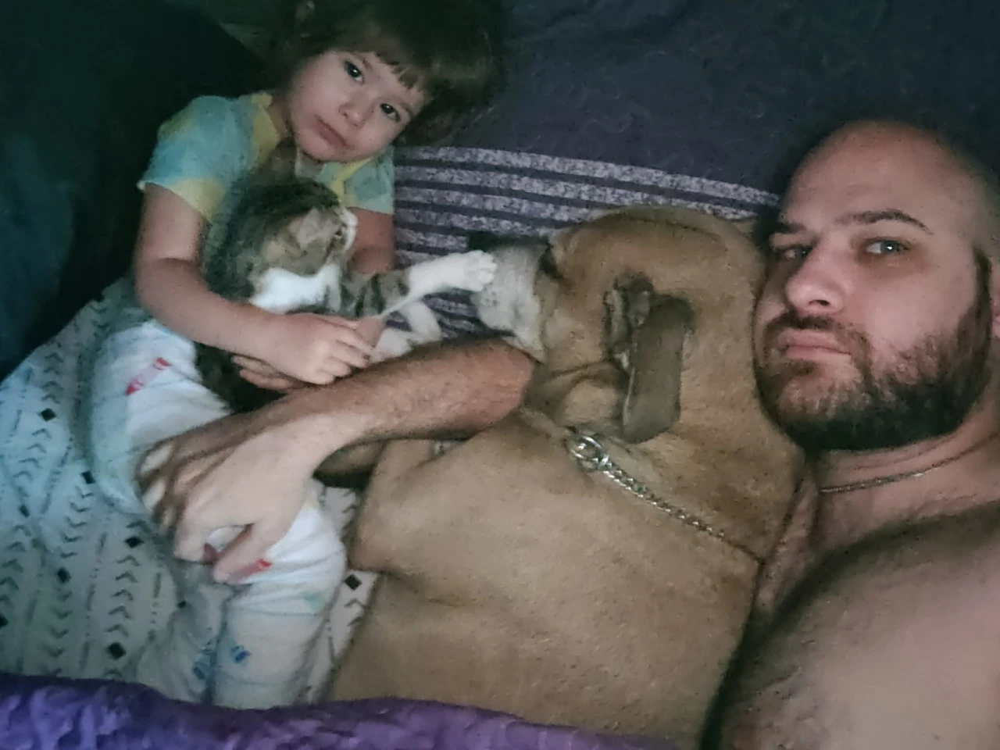
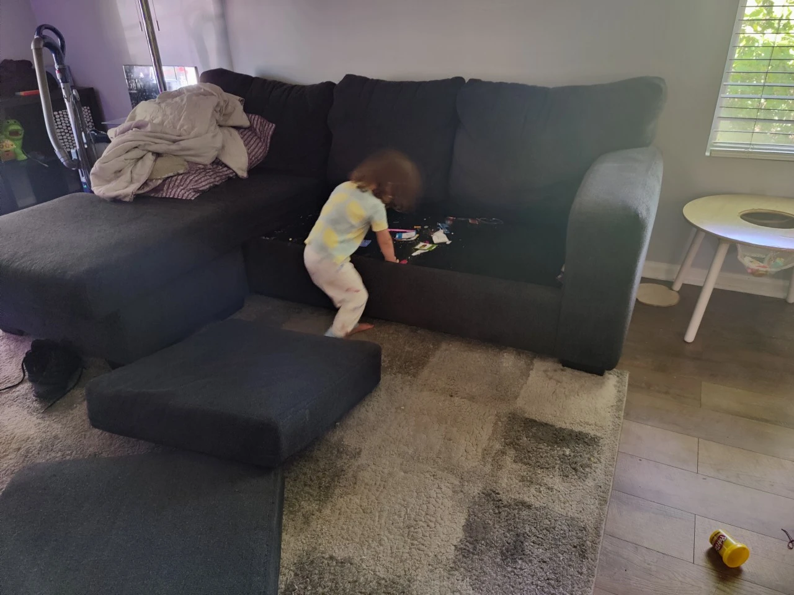
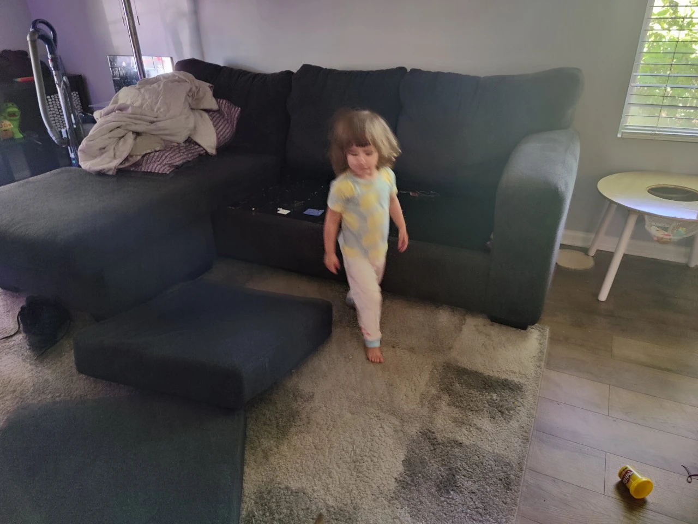
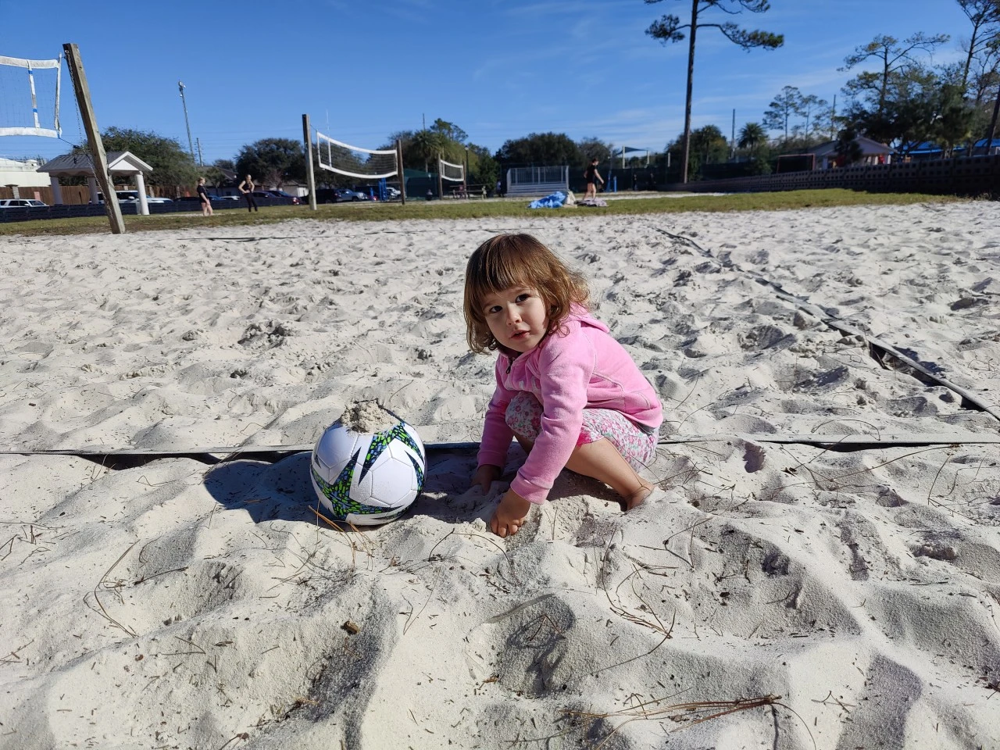
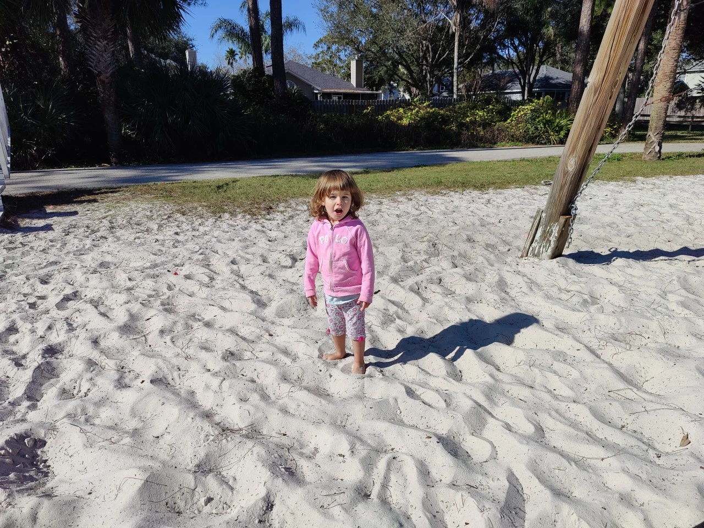
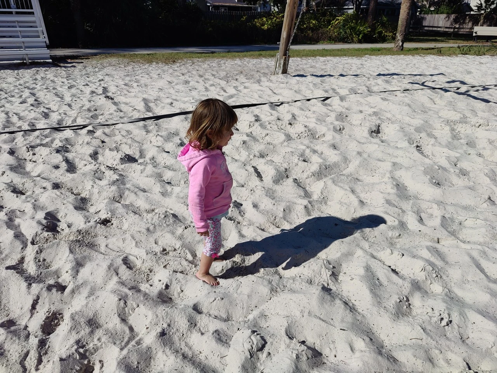
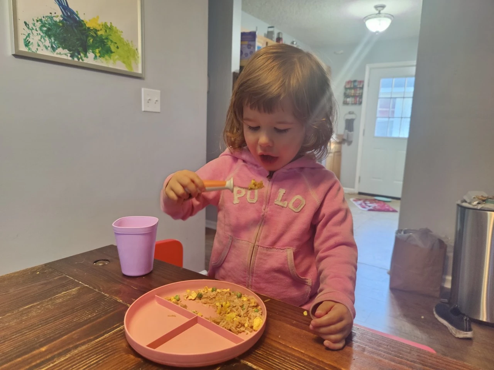
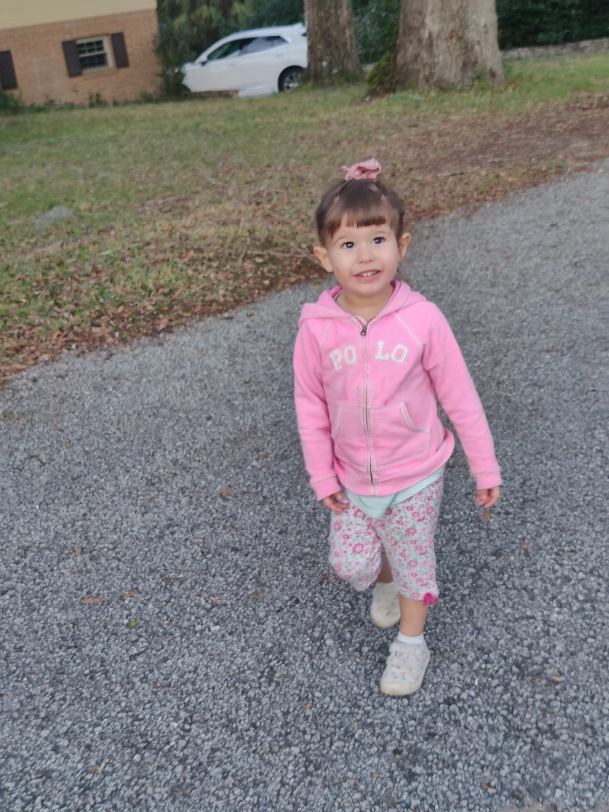
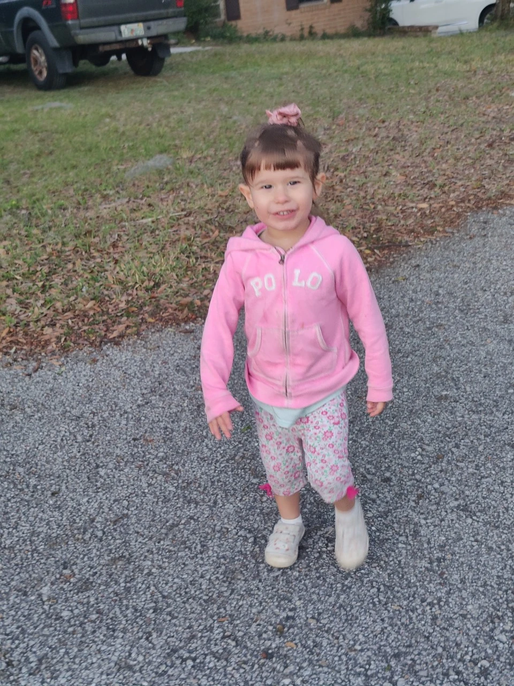
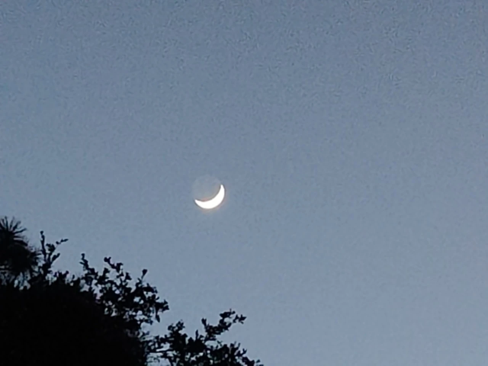

#+TITLE: January  2, 2025
#+INCLUDE: ~/org/blog/noumena/header.org
#+INCLUDE: ~/org/blog/image-preview-header.org

#+HTML_HEAD_EXTRA:<meta property="og:image" content="https://joshua-wood.dev/noumena/2025/january/02/">
#+HTML_HEAD_EXTRA:<meta property="og:image:alt" content="January  2, 2025 alt"/>
#+HTML_HEAD_EXTRA:<meta property="og:description" content="">
#+HTML_HEAD_EXTRA:<meta name="twitter:image" content="https://joshua-wood.dev/noumena/2025/january/02/" />

* Good Morning, Noumena!

* South Beach Park and Sunshine Playground

#+begin_export html

<iframe width="1864" height="705" src="https://www.youtube.com/embed/K1o_wnwH-JM" title="Playing In The Sand" frameborder="0" allow="accelerometer; autoplay; clipboard-write; encrypted-media; gyroscope; picture-in-picture; web-share" referrerpolicy="strict-origin-when-cross-origin" allowfullscreen></iframe>

#+end_export

#+begin_export html

<iframe width="1864" height="705" src="https://www.youtube.com/embed/xFMxEPVV5rQ" title="Rocking Out To Meshuggah With Kowie" frameborder="0" allow="accelerometer; autoplay; clipboard-write; encrypted-media; gyroscope; picture-in-picture; web-share" referrerpolicy="strict-origin-when-cross-origin" allowfullscreen></iframe>

#+end_export

#+begin_export html

<iframe width="1864" height="705" src="https://www.youtube.com/embed/ek7rVMJtO9s" title="Loving Chickens" frameborder="0" allow="accelerometer; autoplay; clipboard-write; encrypted-media; gyroscope; picture-in-picture; web-share" referrerpolicy="strict-origin-when-cross-origin" allowfullscreen></iframe>

#+end_export

* Dinner

* Evening Walk

