#+TITLE: January  3, 2025
#+INCLUDE: ~/org/blog/noumena/header.org
#+INCLUDE: ~/org/blog/image-preview-header.org
#+HTML_HEAD_EXTRA:<meta property="og:image" content="https://joshua-wood.dev/noumena/2025/january/03/julington-durbin-creek-nature-preserve-trail-4-preview.webp">
#+HTML_HEAD_EXTRA:<meta property="og:image:alt" content="January  3, 2025 alt"/>
#+HTML_HEAD_EXTRA:<meta property="og:description" content="">
#+HTML_HEAD_EXTRA:<meta name="twitter:image" content="https://joshua-wood.dev/noumena/2025/january/03/julington-durbin-creek-nature-preserve-trail-4-preview.webp" />

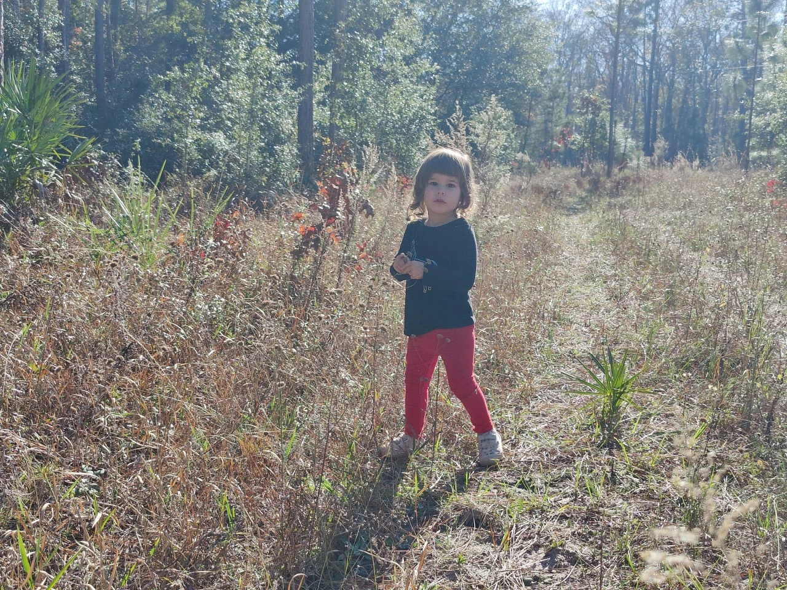

I can't explain what sometimes lights a fire under my ass and gets me back into writing these entries. I feel guilty that it's been so long since I've really sat down to write about our days. Whatever the reason, I'll do my best to make up for lost time as long as I can.

* Good Morning, Noumena!

Our mornings have been quite different since Mommy moved back home. Often, I don't get up with Noumena. Though Noumena always insists on seeing me when she wakes up, a lot of the time, Mommy has slept out on the couch she sometimes makes breakfast for Noumena. Today, I think Noumena had Cheerios.

I've been staying up so late that when Noumena comes in, I just turn on the TV hoping that she watches it while I get some more sleep. While I slept, she was either watching TV or getting into stuff throughout the house. It wasn't until late in the morning that I finally got up. After preparing myself a cup of coffee and sharing with Noumena one of the two bagels I'd made, did I finally get myself in gear.

* Hanging Out At Home

I did dishes and folded laundry as well as cleaned out my car to prepare for the day ahead. I was cleaning out my car because earlier in the morning I had been looking at the AllTrails app and asked Noumena where she wanted to go. I showed her Julington Durbin Creek Nature Preserve and she said she wanted to go there with Chalmers. Of course I was delighted. After having viewed old photos of Chalmers yesterday, I realized he's growing old, so I want to take him out to have as much fun as possible with me and Noumena while we still can, so I was ecstatic when Noumena basically had the same idea. She's really been into having Chalmers tag a long. The last few days we've taken him to the parks with us as well.

#+begin_export html

<iframe width="1864" height="705" src="https://www.youtube.com/embed/GnpJ4oKGxLo" title="Throwing Boat Into Christmas Tree" frameborder="0" allow="accelerometer; autoplay; clipboard-write; encrypted-media; gyroscope; picture-in-picture; web-share" referrerpolicy="strict-origin-when-cross-origin" allowfullscreen></iframe>

#+end_export

For a little while, Noumena helped me clean out my car. When I started, she was preoccupied playing in the living room. But since I am always nervous about leaving her alone, and thinking I heard her yell, I went back in to enlist her help. Of course, her helping is tantamount to her playing in it while I do all of the actual cleaning.

While cleaning, I also cleared out the trunk and had to take a small plastic storage compartment to get hosed off as antifreeze had leaked into it. Noumena followed closely behind. It was then I asked her if she wanted to make peanut butter and jelly sandwiches to take with us to the park. Initially she agreed, but by the time we got back in the house, I asked her again if she wanted to wait and do a picnic or if she wanted to eat right now. She chose to eat then and there but no longer wanted PB&J and asked for chicken nuggets (plant-based of course). Just before we cooked them, I asked if she wanted it accompanied with mustard. She declined. I asked about ketchup. Again, declined. Finally, I asked her if she wanted it with maple syrup. She agreed. After the nuggets were ready, she ate them maple syrup and we finally got out of the house at about 2pm.

* Julington Durbin Creek Nature Preserve

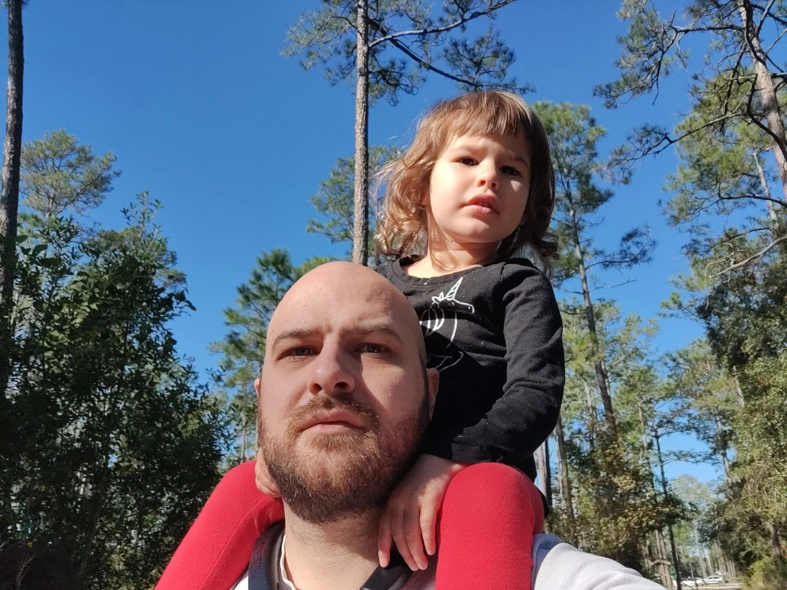

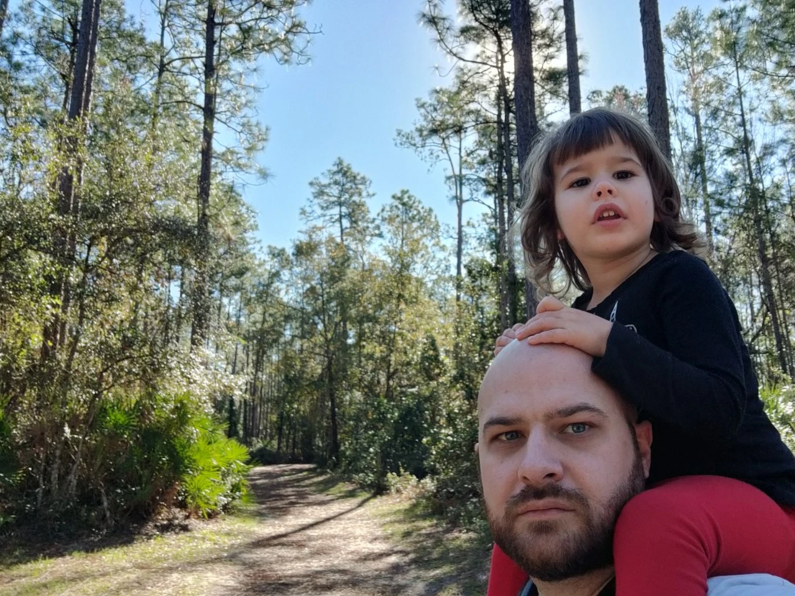

Noumena and I were both super excited right when we got there. Initially, Noumena rides my shoulders to the trailhead, but doesn't want to be carried for long instead opting to run. She runs as Chalmers and I walk along side her for maybe half a mile with Chalmers pooping along the way. I didn't prepare for him to poop and I thought he'd gotten in all out in the shrubbery off the path earlier. But as we're walking, he starts going again right in the middle of the path! There were a bunch of Pine leaves, so I covered it with them using my shoe and tried inconspicuously moving it off to the side. Noumena sees this and there are people walking not too far behind us. Then she starts /narrating/!

#+begin_quote
"Daddy, Chalmers poop?"

"Yes, honey."

"Daddy, you move Chalmers' poop?"

"Yes, honey."

"Why?"

"Because I didn't want those people to know about it"

"Why?"

"Because I didn't want those people to know about it"
#+end_quote

It's not long before we reach a fork in the road and I want Noumena to choose which path we go down.

#+begin_export html

<iframe width="1864" height="705" src="https://www.youtube.com/embed/Jv_uThzA1RI" title="Walking In Julington Durbin Creek Nature Preserve" frameborder="0" allow="accelerometer; autoplay; clipboard-write; encrypted-media; gyroscope; picture-in-picture; web-share" referrerpolicy="strict-origin-when-cross-origin" allowfullscreen></iframe>

#+end_export

Little did I know that letting a toddler choose which path we'd go was not exactly the best idea. Following Noumena's suggestion to take the left-most path ended up taking us by the outskirts of the nature preserve and we alongside the suburbs adjacent to the preserve. I took the opportunity to castigate Noumena for her decisions telling her she picked the wrong way. As I carried her atop my shoulders walking along the houses, I gestured to the left saying the houses were bullshit and to the right was nature while she quickly followed suit.

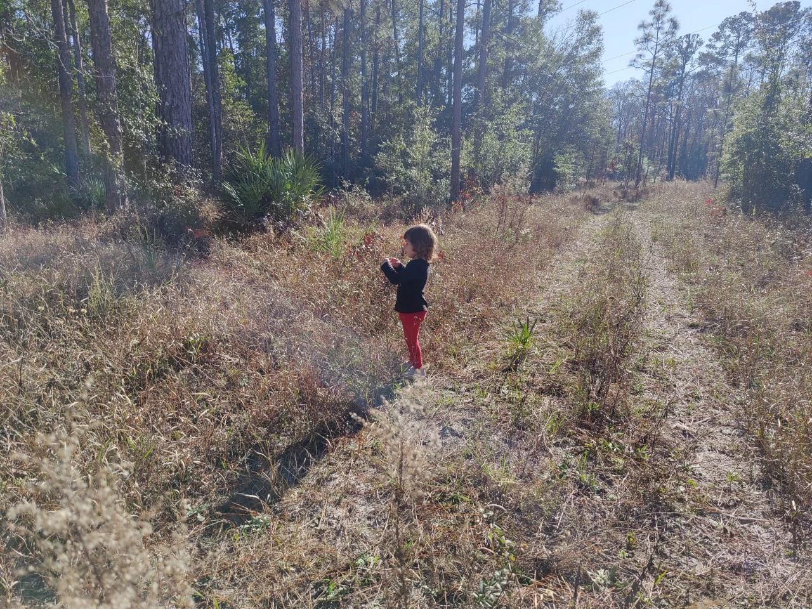

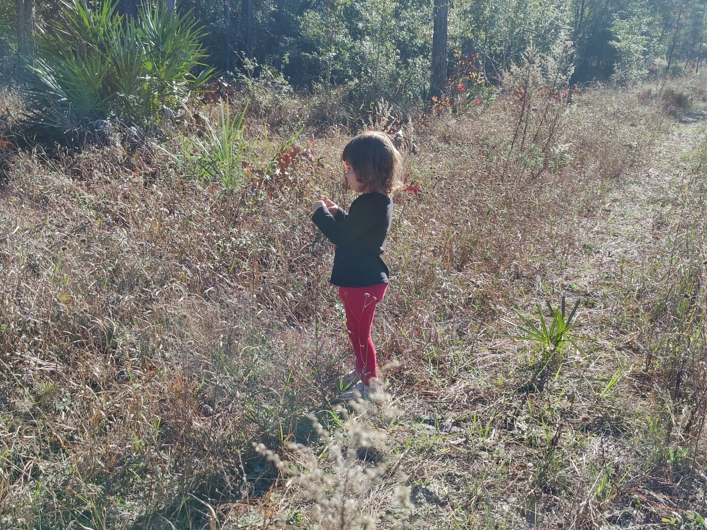

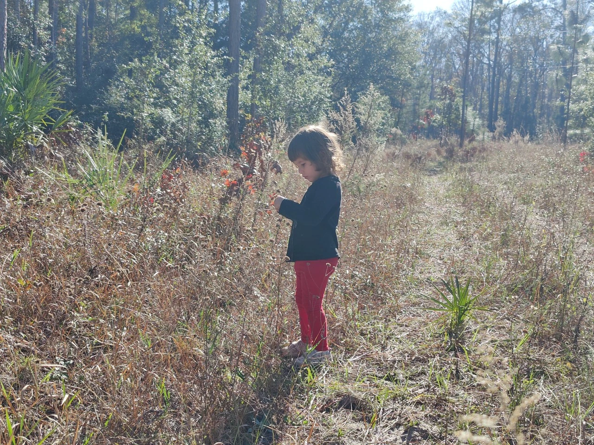

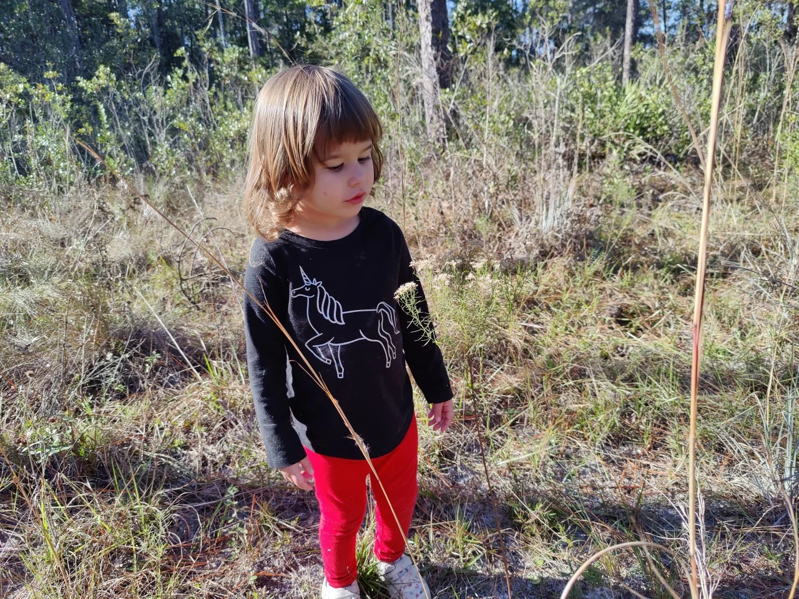

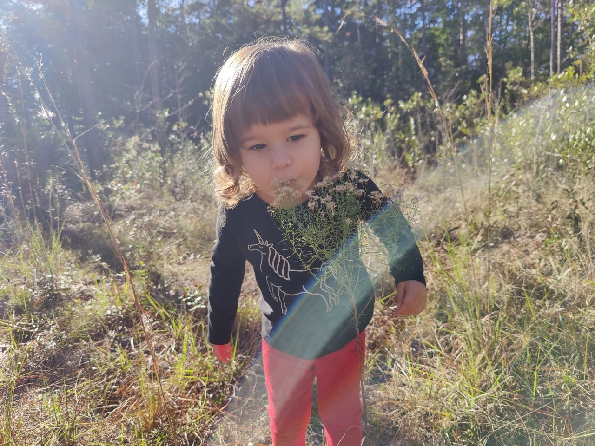

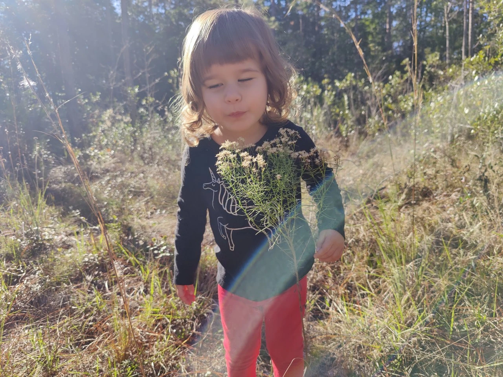

#+begin_export html

<iframe width="1864" height="705" src="https://www.youtube.com/embed/em8ZPhw5MVU" title="More Walking With Chalmers In Julington Durbin Creek Nature Preserve" frameborder="0" allow="accelerometer; autoplay; clipboard-write; encrypted-media; gyroscope; picture-in-picture; web-share" referrerpolicy="strict-origin-when-cross-origin" allowfullscreen></iframe>

#+end_export

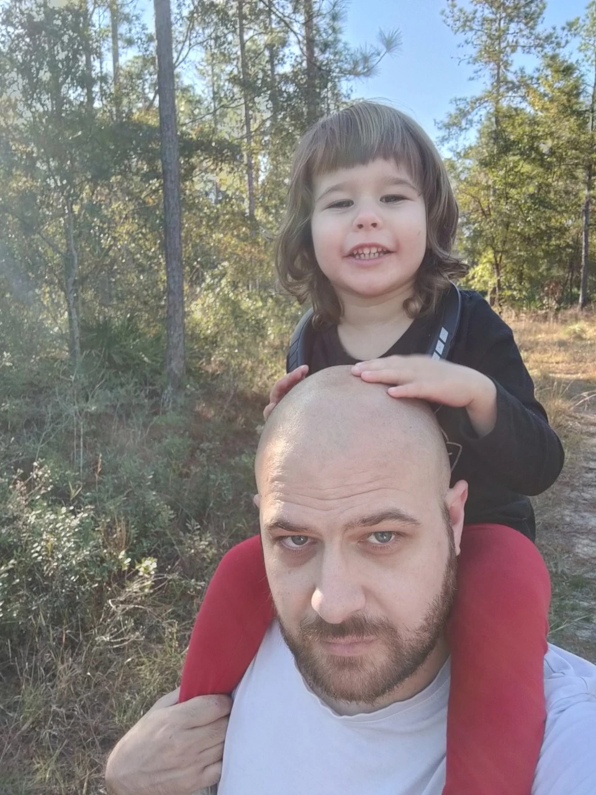

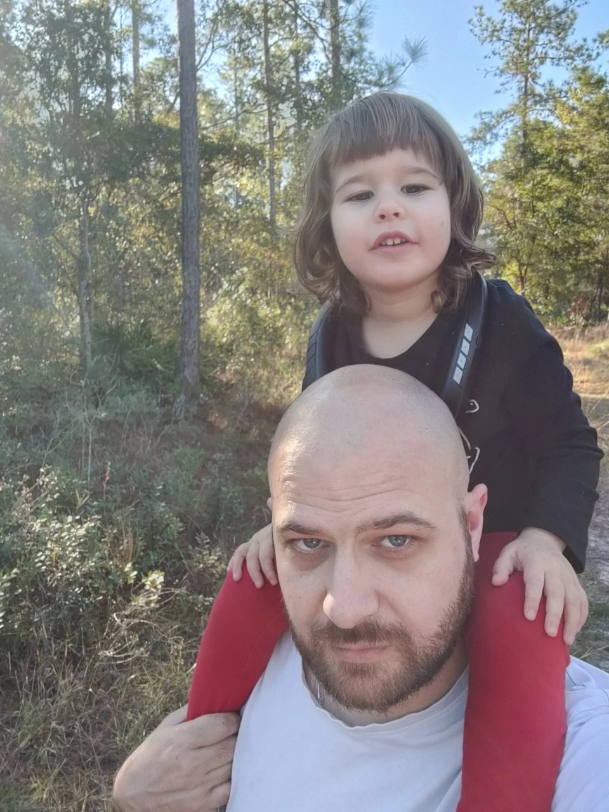

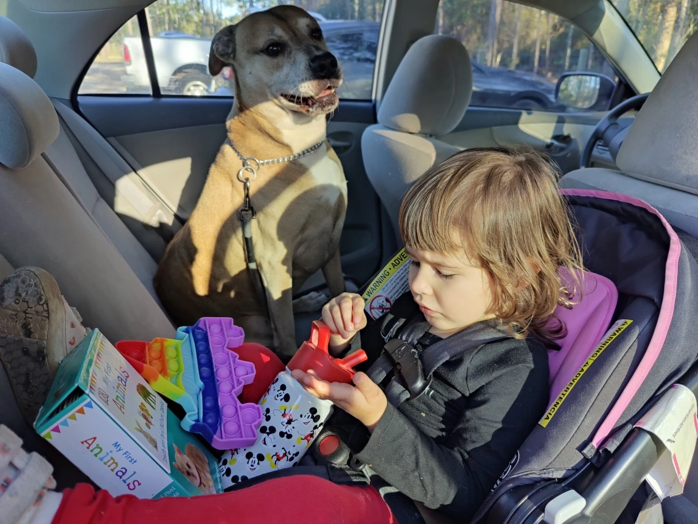

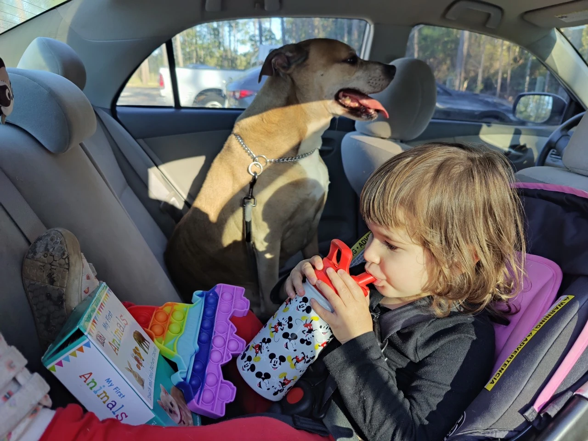

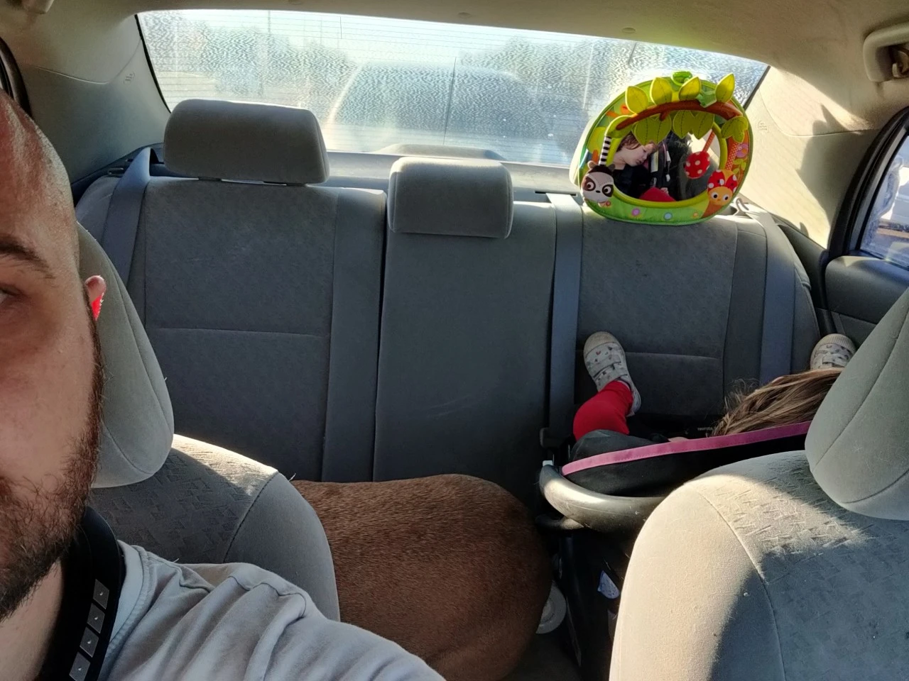

* Playing Outside

Noumena only napped for about the last 15 minutes of the car ride home. After we arrived, Noumena awoke and I took her inside. I laid her down in the bed thinking she might fall back asleep, but she never did. Instead, while I was trying to get dinner ready after she said she wanted to eat French toast, she ran up with a bag of chalk in her hands saying she wanted to go draw. I made her get her shoes and Jacket on and out we went.

By the time we'd gotten outside, Noumena played very little with the Chalk. Instead, she took JJ from CocoMelon out in her stroller and was running all over the place. I didn't want to do nothing while she ran, so I swept the porch keeping a careful eye on her telling her that if she went in the street her time was over. For a long time, she played, but eventually found herself in the street. So I picked up her stroller with JJ in it and walked it inside while Noumena followed crying.

* Dinner

She was very upset, but calmed down rather quickly and eventually asked for some soymilk once she was calm. I gave it to her and she helped me make dinner. I asked Noumena what she wanted earlier and she said french toast, so we ate that after she helped me prepare it. After dinner, I asked Noumena if she wanted to go to the trampoline park and that if she did we had to leave immediately. She said she did so we rushed out the door.

* Trampoline Park

* Bath Time

* Bed Time
