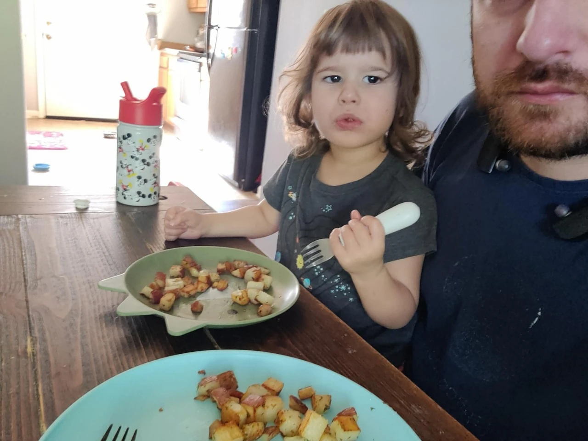
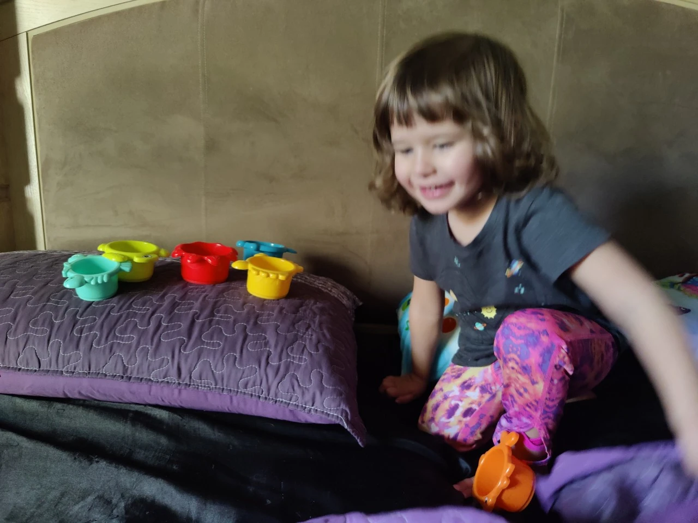
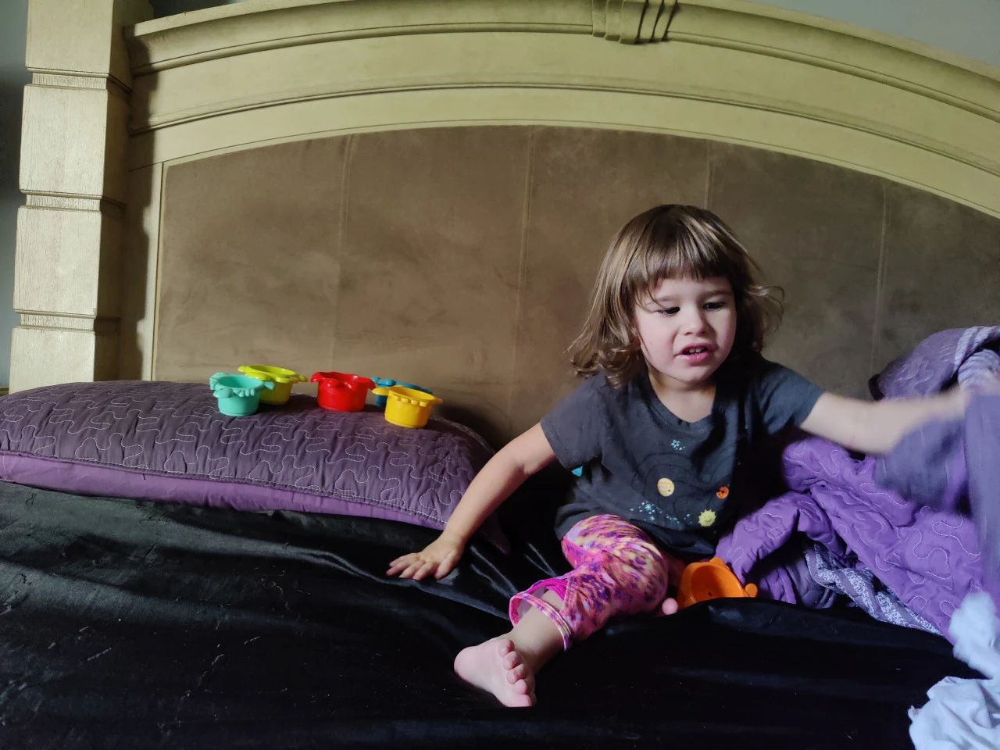

#+TITLE: January  5, 2025
#+INCLUDE: ~/org/blog/noumena/header.org
#+INCLUDE: ~/org/blog/image-preview-header.org

#+HTML_HEAD_EXTRA:<meta property="og:image" content="https://joshua-wood.dev/noumena/2025/january/05/eating-grandpas-potatoes-preview.webp">
#+HTML_HEAD_EXTRA:<meta property="og:image:alt" content="January  5, 2025 alt"/>
#+HTML_HEAD_EXTRA:<meta property="og:description" content="">
#+HTML_HEAD_EXTRA:<meta name="twitter:image" content="https://joshua-wood.dev/noumena/2025/january/05/eating-grandpas-potatoes-preview.webp" />

* Good Morning, Noumena!

At some point super early this morning before sunrise, Noumena crawled into bed with me. I can't remember her exact phraseology, but she expressed that she wanted to climb in bed and watch TV. I told her that TV wasn't on the table but that she could go crawl into bed with me, half expecting a mild fit and not getting what she wanted. Instead she crawled up next to me, cuddled close and fell asleep. I was pleasantly surprised.

I know Noumena slept until after 7:20am, because she was still nestled up close as my alarm went off, but after that she awoke. When she did, I wasn't ready to get up. I can't remember if it was at her request or just something I could do to get more shut-eye, but I turned the TV on and let her rot her brain while I caught more Z's.

Noumena ran in and out of my bedroom all morning while Mommy spent some time with her in the living room.

* Lazy Day At Home

When I finally pulled myself out of bed at about 10:30am, Noumena was talking about how hungry she was. We had just run out of soymilk the night before and Mommy ordered it from Walmart grocery delivery, but it hadn't arrived yet. I asked Noumena if she wanted dry cereal. At first she objected saying that she wanted soymilk as well, but after I explained that there was no more soymilk, she reluctantly said that she wanted dry cheerios.

At some point during the late morning, she said she wanted potatoes. We'd recently bought potatoes at the store, again at Noumena's request, and so when she asked, we were prepared. The last time we bought potatoes and made mashed potatoes I was running an experiment to see if red potatoes made good mashed potatoes. Well, during that time, I had a bunch of red potatoes left over, so I called my dad, Noumena's grandpa, and asked him how he made these potatoes I loved growing up. Well, it turns out that loving potatoes cooked that way runs in the family, as she couldn't have been happier eating them.

#+begin_export html

<iframe width="1905" height="705" src="https://www.youtube.com/embed/d7YWnJJN1UY" title="Eating Grandpas Potatoes" frameborder="0" allow="accelerometer; autoplay; clipboard-write; encrypted-media; gyroscope; picture-in-picture; web-share" referrerpolicy="strict-origin-when-cross-origin" allowfullscreen></iframe>

#+end_export

#+begin_export html

<iframe width="1905" height="705" src="https://www.youtube.com/embed/fgvw4K2uDmI" title="Trying To Remove The Sheets Part 1" frameborder="0" allow="accelerometer; autoplay; clipboard-write; encrypted-media; gyroscope; picture-in-picture; web-share" referrerpolicy="strict-origin-when-cross-origin" allowfullscreen></iframe>

#+end_export

#+begin_export html

<iframe width="1905" height="705" src="https://www.youtube.com/embed/0lGu5dj7xJk" title="Following Noumena Trying To Figure Out What Shes Doing" frameborder="0" allow="accelerometer; autoplay; clipboard-write; encrypted-media; gyroscope; picture-in-picture; web-share" referrerpolicy="strict-origin-when-cross-origin" allowfullscreen></iframe>

#+end_export

#+begin_export html

<iframe width="1905" height="705" src="https://www.youtube.com/embed/tdAhdIWL86g" title="First Time Daredevil Jumping Solo" frameborder="0" allow="accelerometer; autoplay; clipboard-write; encrypted-media; gyroscope; picture-in-picture; web-share" referrerpolicy="strict-origin-when-cross-origin" allowfullscreen></iframe>

#+end_export

While she was eating, she said that she wanted to see Chris, so I sent him that video and video called him to see if he was available to hang out with us. She performed her daredevil jump on the phone with Chris as well and we decided to go meetup with him. After some fiddling about, I was able to wrangle Noumena into the car and off we went to Chris' house.

Noumena has 2 stuffed elephants---one small and one large. When we get to the car, the small elephant is the only one there, so Noumena asks where the daddy elephant is. It tell her it's probably in her closet and ask her if she wants me to get it. She does, so I leave her strapped in the car to go get it and return shortly thereafter to head out. She played with the elephants the whole way there.

* Meeting Up With Chris

When Noumena and I get to Chris' house, he must have been vacuuming or something because he didn't come to the door right away. I rang the door bell and knocked and called, but we had to still wait a little while for him to realize we were there. When he came down, Noumena was so excited to see him. She really loves Chris.

We walked just down the street to a church that also has a playground and let Noumena play there while Chris and I did pull ups and arm wrestled. Chris let me win. I think it's because he felt sorry for me because I'm short and bald and he's tall and handsome. Who knows? In any case, it was a boost to my ego.

Noumena climbed all the way up a really tall set of bars all by herself, only needing a little coaching assistance from Daddy and jumped from more impressive heights. We swung a little then I realized that she pooped so we went to the car to change her.

After Noumena was changed, Chris and I discussed walking down to Memorial park, but ultimately decide to just drive there. Chris gets his jacket and we drive off while Noumena plays with her elephants again the entire way there.

* Memorial Park

We park in the Thai restaurant parking lot because parking everywhere else is full, take Noumena's soccer ball out and play for a little while. Noumena starts off kicking the ball. It's funny that she kicks it with her left foot even though her right hand is her dominant hand. Eventually, she makes her way to the fountain and asks to go onto the ledge perimeter of it. I put her up there and she shortly wants down and then goes to look at the river. She also wants a good look there, so I hoist her up on the ledge and she asks me not to throw her in. Such a funny request

#+begin_export html

<iframe width="1905" height="705" src="https://www.youtube.com/embed/c3hg_GOtmGg" title="Playing Soccer With Chris" frameborder="0" allow="accelerometer; autoplay; clipboard-write; encrypted-media; gyroscope; picture-in-picture; web-share" referrerpolicy="strict-origin-when-cross-origin" allowfullscreen></iframe>

#+end_export

#+begin_export html

<iframe width="438" height="778" src="https://www.youtube.com/embed/qchgywWF9x0" title="Daddy Throwing Noumena" frameborder="0" allow="accelerometer; autoplay; clipboard-write; encrypted-media; gyroscope; picture-in-picture; web-share" referrerpolicy="strict-origin-when-cross-origin" allowfullscreen></iframe>

#+end_export

* Dinner

Chris gets in contact with his wife Vanessa, and we decide we're going to a taco place to eat together. She meets us outside of the grocery store we went to so I could use the restroom and then Noumena, Chris, Vanessa and I all walk to the taco bar. Noumena eats corn and rice. I got a rice bowl and she didn't want the cauliflower, but she ate almost all my rice and all of her corn.

After, it's time to take Chris and Vanessa home, so we make our way back to my car. Luckily it hasn't been towed.

#+begin_export html

<iframe width="1905" height="705" src="https://www.youtube.com/embed/xMHx9JtKvR8" title="Walking With Vanessa" frameborder="0" allow="accelerometer; autoplay; clipboard-write; encrypted-media; gyroscope; picture-in-picture; web-share" referrerpolicy="strict-origin-when-cross-origin" allowfullscreen></iframe>

#+end_export

Vanessa tells Noumena stories on the way to their house complaining that telling stories in English is harder than Spanish. I thought the stories in English were fine, but regardless, Vanessa decides to start telling them in Spanish. I could tell it didn't make a difference to Noumena at all. She loved it both ways. We arrive at Chris' house, Noumena gives Chris a hug and says good bye to Vanessa and we head home. I tell her not to sleep at all because her bed time is in a couple hours. To my surprise, she stays awake the entire car ride playing with her elephants the whole way home.

* Back At Home

#+begin_export html

<iframe width="1905" height="705" src="https://www.youtube.com/embed/1xScOuC2HJ0" title="Hiding In The Sheets" frameborder="0" allow="accelerometer; autoplay; clipboard-write; encrypted-media; gyroscope; picture-in-picture; web-share" referrerpolicy="strict-origin-when-cross-origin" allowfullscreen></iframe>

#+end_export
