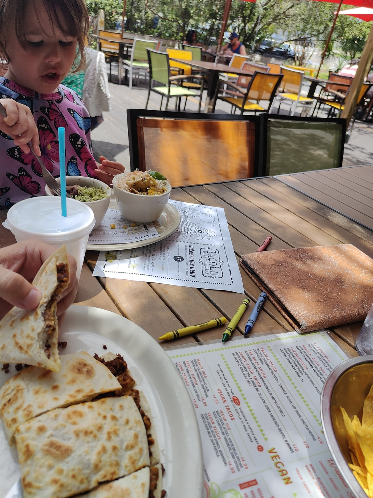
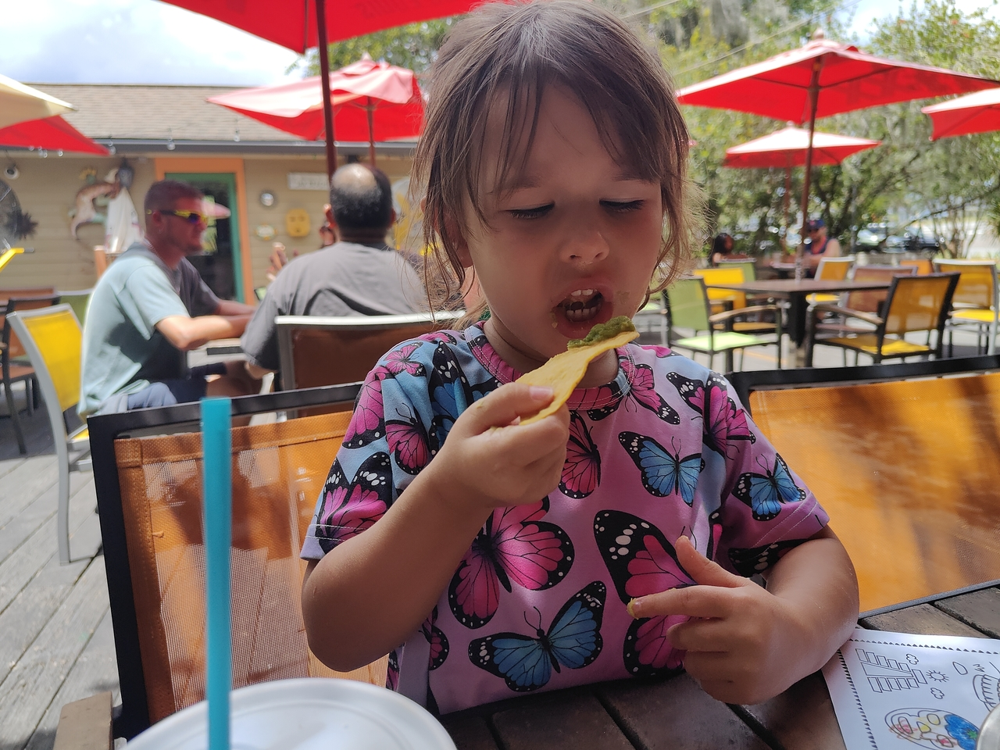
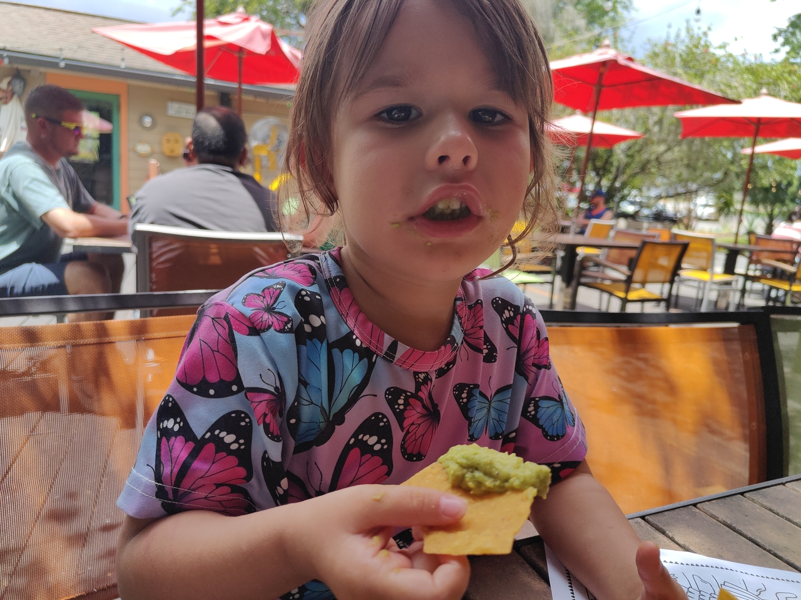
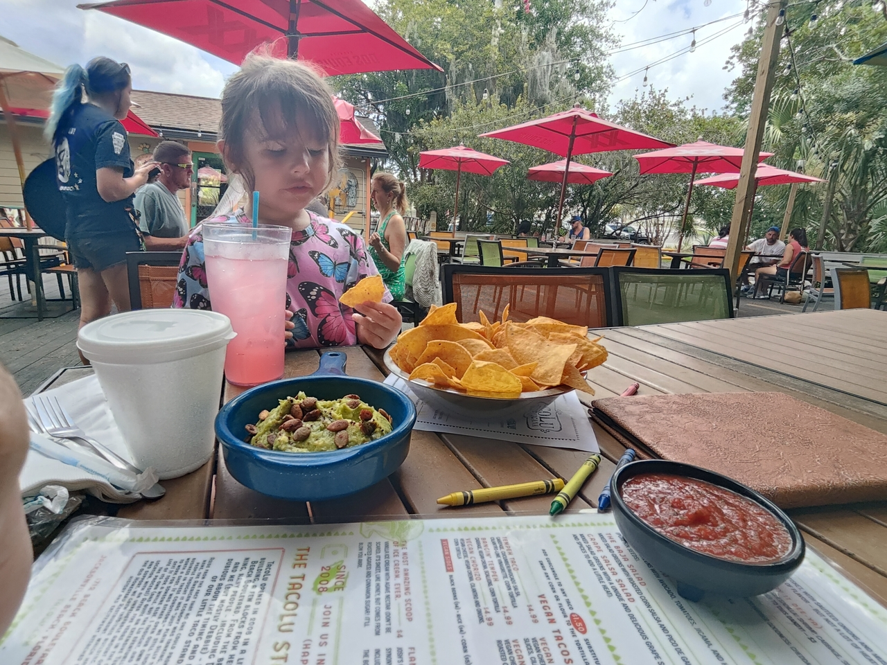
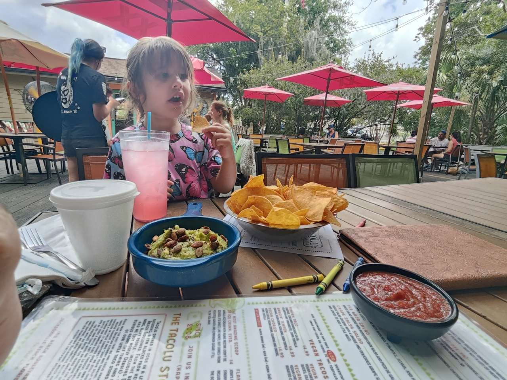
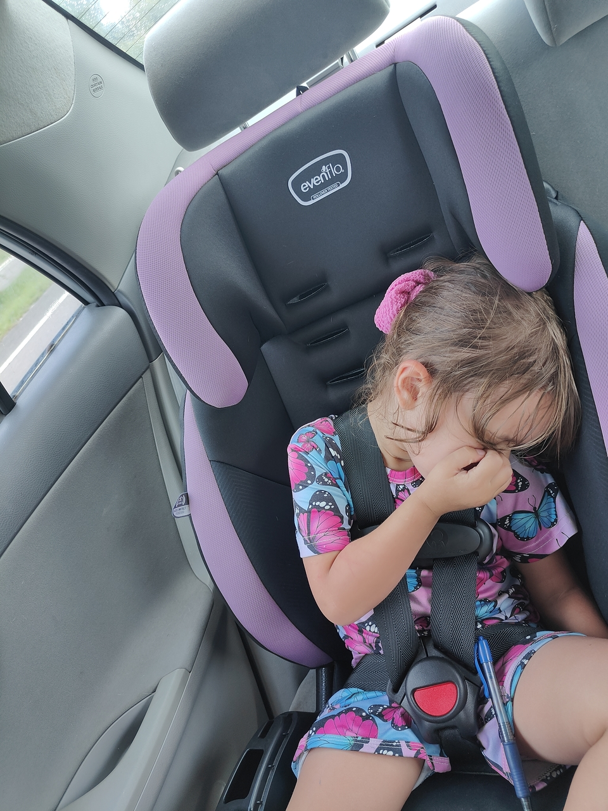
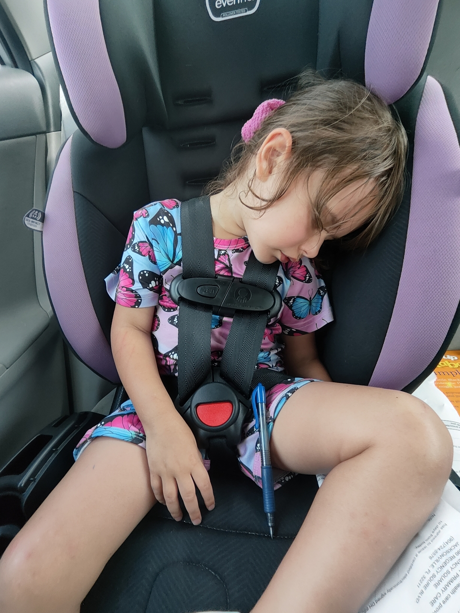

#+TITLE: July 12, 2025
#+INCLUDE: ~/org/blog/noumena/header.org
#+INCLUDE: ~/org/blog/image-preview-header.org

#+HTML_HEAD_EXTRA:<meta property="og:image" content="https://joshua-wood.dev/noumena/2025/july/12/"/>
#+HTML_HEAD_EXTRA:<meta property="og:image:alt" content="July 12, 2025 alt"/>
#+HTML_HEAD_EXTRA:<meta property="og:description" content="">
#+HTML_HEAD_EXTRA:<meta name="twitter:image" content="https://joshua-wood.dev/noumena/2025/july/12/" />

* Pancakes!

Noumena wanted pancakes this morning. Of course I obliged. It was 7:30am when she woke up and we finished eating quickly. I asked if she wanted to go to Sunshine beach park and she said she did. They have a splash park we intended to go to, so I packed everything into the backpack making sure we had ample sunscreen and water and we headed out.

* Sunshine Beach Park

When we arrived at about 9am, we made a beeline straight for the water park. It was closed! It was supposed to be open by 9! We tried both the main splash pad as well as the one for toddlers and they were both closed. I told Noumena, already dressed in her bathing suit, that they were closed. She settled for playing at the park a little bit to my surprise.

Noumena ran for the toddler section of the park where I got to talking to one of the moms about the reason we were there. This mom made reference to a splash pad her nanny took her children to, which gave me the impetus to start looking for alternatives because it was so hot outside. After searching, I looked up to find Noumena bouncing on the teeter-totter. I asked her if she was teetering or tottering to which she replied "tottering."

Eventually, we  made our way to the swings where I decided we'd go to a waterpark that was only 10 minutes away. She asked for five minutes on the toddler swing and when that time was up, I took her to go potty and then we left to go to the water park.

#+begin_export html

<iframe width="358" height="637" src="https://www.youtube.com/embed/w3ROnY-oTlg" title="Giving Attitude On Way To Shipwreck Island Water Park" frameborder="0" allow="accelerometer; autoplay; clipboard-write; encrypted-media; gyroscope; picture-in-picture; web-share" referrerpolicy="strict-origin-when-cross-origin" allowfullscreen></iframe>

#+end_export

* Shipwreck Island Water Park

Noumena and I were both so excited to go to the park! She jumped in the shallow end right away. I tried to encourage Noumena to go down the water slides but she was quite scared. Of course, I never pressure her to do take risks she's not ready for. Instead, we continued wading around in the shallows, periodically saving unfortunate June beetles who had made their way into the pools.

#+begin_export html

<iframe width="1559" height="548" src="https://www.youtube.com/embed/BsA6T9Y5pLo" title="Playing At Shipwreck Island Water Park" frameborder="0" allow="accelerometer; autoplay; clipboard-write; encrypted-media; gyroscope; picture-in-picture; web-share" referrerpolicy="strict-origin-when-cross-origin" allowfullscreen></iframe>

#+end_export

To my surprise, Noumena decided it was worth the risk to go down the slide! First with Daddy a couple of times and then all by herself on a loop. I thought I'd test her resolve so I took her up to the larger slides. She didn't want to go down them, but instead waited at the top to push Daddy and watch me go down!

Noumena and I spent an inordinate amount of time in the lazy river. The first go around, we ended up getting bombarded by a waterfall. Noumena hated it! It took a lot to convince her that I would avoid it the next time around, but when we did, she softened to the idea. The third time around, I held the wall keeping us out of reach of the falling water. On subsequent rounds, if I took my hand away, she whined and insisted I kept my hand on the wall to keep us close and out of the clutches of the waterfall. Most of the time in the river, I would lay on the tube and she'd hang off the side holding onto my hand periodically asking for help up but sometimes just helping herself up.

* Linner

#+ATTR_ORG: :width 0.7

#+ATTR_ORG: :width 0.7

#+ATTR_ORG: :width 0.7

#+ATTR_ORG: :width 0.7

#+ATTR_ORG: :width 0.7

* Driving Home

#+ATTR_ORG: :width 0.7

#+ATTR_ORG: :width 0.7

* Watching Frozen

#+begin_export html

<iframe width="1559" height="548" src="https://www.youtube.com/embed/_1g_5BXWdJ8" title="Reenacting Frozen" frameborder="0" allow="accelerometer; autoplay; clipboard-write; encrypted-media; gyroscope; picture-in-picture; web-share" referrerpolicy="strict-origin-when-cross-origin" allowfullscreen></iframe>

#+end_export

* Finding Hoppers

* Bath & Bed Time
