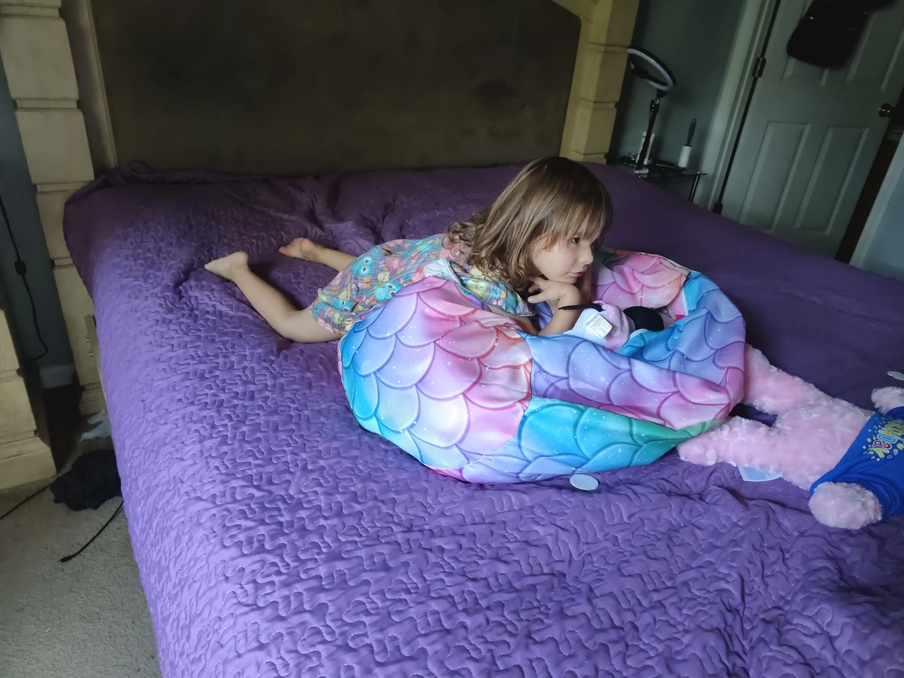

#+TITLE: June 17, 2025
#+INCLUDE: ~/org/blog/noumena/header.org
#+INCLUDE: ~/org/blog/image-preview-header.org

#+HTML_HEAD_EXTRA:<meta property="og:image" content="https://joshua-wood.dev/noumena/2025/june/17/watching-tv-in-the-morning.webp">
#+HTML_HEAD_EXTRA:<meta property="og:image:alt" content="June 17, 2025 alt"/>
#+HTML_HEAD_EXTRA:<meta property="og:description" content="">
#+HTML_HEAD_EXTRA:<meta name="twitter:image" content="https://joshua-wood.dev/noumena/2025/june/17/watching-tv-in-the-morning.webp" />

* Good Morning, Kiddo!

Noumena begins her morning routine of eating breakfast with Mommy before coming into the bedroom to watch TV for a little while until she starts her day. Mommy has to take Noumena's sister Lily to a doctors appointment and Noumena is going to accompany Mommy all day. Before she leaves, she gets the idea to bring her bean bag (perhaps a misnomer) full of stuffed animals into the bedroom and plops it on the bed.

Noumena and Mommy leave for the day and Mommy takes Noumena to visit her sisters other siblings and her sister's father's house.

* Playing In The Rain

It's raining heavily by the time I get off work. Noumena's in my bedroom laying on my bed when I come in to greet her. Upon getting on the bed with her and giving her affection, she laments that it's raining and that means we can't go outside. Now, I've seen this girl run into thunderstorms without a care in the world. In fact, weeks ago, she did just that. So I immediately retort, "Who says?" And tell her "let's go play in the rain." Immediately, her eyes light up! Her excitement is overflowing and she can't contain her jittery behavior!

I was also talking to Mommy about dinner plans were during this time and I made the mistake of trying to get Noumena involved after I had just hyped her up about playing in the rain. When I ask if she wants to eat Thai food, she isn't interpreting that as after we get done playing in the rain so she thinks I just pulling the rug out from under her. Of course, I'm not. I'm just trying to plan, but she's already so upset.

Since Mommy and I had already decided, I reassure Noumena that we're just going to go play in the rain and decide I'll save the dinner conversation for later. She's still a little perturbed. I wish I hadn't said anything. However, I insist on getting us out the door and when we finally get her shoes on and get her outside, everything is... pardon the expression... /right as rain/. I wore a pair of old shoes and I fully intended on getting wet and playing with her in the rain.

#+begin_export html

<iframe width="1547" height="564" src="https://www.youtube.com/embed/y1aSREH6Pjg" title="Running Out Into The Rain" frameborder="0" allow="accelerometer; autoplay; clipboard-write; encrypted-media; gyroscope; picture-in-picture; web-share" referrerpolicy="strict-origin-when-cross-origin" allowfullscreen></iframe>

#+end_export

While filming, the water droplets were falling on my touch screen stopping the recording early. I started another recording.

#+begin_export html

<iframe width="1547" height="564" src="https://www.youtube.com/embed/iZ9TyeA2uEE" title="Playing In Puddles" frameborder="0" allow="accelerometer; autoplay; clipboard-write; encrypted-media; gyroscope; picture-in-picture; web-share" referrerpolicy="strict-origin-when-cross-origin" allowfullscreen></iframe>

#+end_export

I knew there were even deeper puddles close to the busy street adjacent to our back yard, and so I ask Noumena if she'd like to visit those. Without hesitation she does, so I take her down the street to the large puddles lining the main road. At this point, I'm thoroughly soaked and I start getting paranoid that my phone will retain permanent damage. I explain to Noumena that I'm worried that I'll damage my phone so we have to take it back. She asks why so I tell her that the electric components might get damaged by the water. She repeats my phrasing flirting with the concept of damage. I assure her that we're just going right back out once my phone is safe. I ring the door bell, hand Mommy the phone and proceed to take Noumena back to the large puddles.

The largest of all the puddles and the one we end up spending most of our time in is right across and lining the busy street. As I'm taking her over there she says "I'm not ugly." I have no idea where she's getting this thing about her being ugly. She certainly never got it from me. Like most parents, I'm sure, there isn't anything that could make this girl not the most beautiful thing in all of existence in my eyes. So I start probing.

I asked Noumena if someone called her ugly. She says yes and so naturally, I ask who. She says a worker at her Daycare, Miss Tina, does. Immediately, I'm very concerned. It's unfortunate that I can't just trust her testimony. I continue pulling this thread asking again after a brief topic change. Upon asking Noumena again who calls her ugly, she says "people." So I start asking which people. She doesn't give the same answers. I ask her if Mommy calls her ugly, something I'm confident has never occurred. She replies "yes." That's when I lose all confidence that her teacher had actually said it.

What is a parent supposed to do? I want so badly to defend her of course and teach people the forms of acceptable engagement with my child, but so long as I can't trust her testimony, it feels imprudent to confront anyone about it. Such is the dilemma of parenting.

After this fleeting concern, I let her run and jump and play in the large puddle while I watch her and the traffic vigilantly. We played for almost an hour and a half.

Usually, since I have my phone with me, when it's time to stop an activity I know Noumena won't want to stop, I set a timer for an allotted period and when it goes off, she's almost always amenable to stopping the activity. I surmise that the reason is that setting a timer feels more objective less arbitrary and authoritarian which is why it's typically so easy to get her to comply when it goes off. When I say it's time to go, she says she wants a 3 minute timer. But, since I didn't have my phone, I decide to set an number of times we'll do an activity as the stopping point. In this case, I had just been holding her arms and swinging her legs to and fro through the puddle, so I tell her that we are going to do it five more times before it's time to go. I make these final five swings last as long as I can manage and have Noumena count them in succession with me until we reach five and it's our time to go.

* Dinner

When Noumena and I arrive home, she's gotten so dirty from playing in puddles---made worse no doubt because I was swinging her through them---that I can't justify taking her to dinner without having showered first. I want to limit tracking the grime inside the house, so before we even go through the front door, we remove our shoes and once we're inside, I strip her naked and down to my underwear and take her to shower with me.
