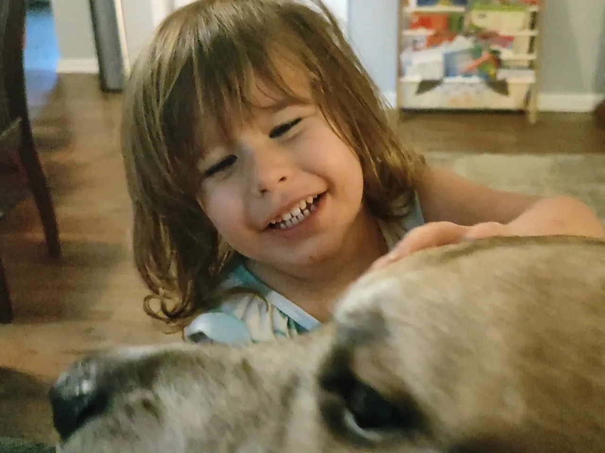

#+TITLE: June 20, 2025
#+INCLUDE: ~/org/blog/noumena/header.org
#+INCLUDE: ~/org/blog/image-preview-header.org

#+HTML_HEAD_EXTRA:<meta property="og:image" content="https://joshua-wood.dev/noumena/2025/june/20/photo/smiling-with-chalmers-preview.jpg"/>
#+HTML_HEAD_EXTRA:<meta property="og:image:alt" content="June 20, 2025 alt"/>
#+HTML_HEAD_EXTRA:<meta property="og:description" content="">
#+HTML_HEAD_EXTRA:<meta name="twitter:image" content="https://joshua-wood.dev/noumena/2025/june/20/photo/smiling-with-chalmers-preview.jpg" />

* Good Morning, Sweet Pea!

I barely get a chance to say goodbye to Noumena this morning! She's already ready for daycare by the time I awake. She only comes in to say goodbye to me. For some reason, She's excited to go to daycare today!!! Maybe it has to do with the fact that today is pajama day! She must be excited to see all the other kids in their PJ's. She kisses me as a farewell and runs out the door!

* Playing Hide And Seek

Once I get off work, Noumena tells me "let's play hide and seek!" immediately. She starts by hiding under her pillow on her bed. Once I discover her, she runs away behind the door. I pretend to look for her under the bed and I get a sinister idea. "Noumena! What's that?" I say on my hands and knees peering under her bed. She comes out from behind the door to investigate. "I TRICKED YOU AAAAHAHAHAHA!!!" I exclaim while wrestling her to the ground!

* Trip To Publix

Lily came over with her boyfriend Matthew, and because I'm trying to feed two teenagers, I'm trying to get out of the house to go to the store and get enough food. Noumena's mom and I have a brief quibble about Noumena being able to put on her shoes. Noumena of course proves me right. Once she's wearing her footwear, Noumena and I head out the door.

Noumena wants a purse that has coins in it. She loves playing with those coins on car rides. But since she's already strapped in and I want to get going, I tell her she can play with something else. She doesn't want anything else and cries the same phrase over and over practically the entire car ride to Publix: "I want my pink purse!" A few times I try to quell her telling her I understand how she feels and asking her to elaborate, but it's of little use. She calms only as we're entering the parking lot and she sees the car-shaped shopping carts.

Noumena wants to ride them, so of course I oblige. I zip through the aisles getting the spaghetti, green beans and sour dough bread for tonight's dinner. The bread is the last stop and it's at the same end as the roasted pistachios and fruit. Noumena asks for an apple, but I open the bag of pistachios in the store to snack on for myself first. Because I offer her some, she seems to think this implies that I'm saying I'm not going to get her fruit. It's not true of course. I was simply offering them to her because they're great. She resists until we get to her true objective: the kids fruit they offer for free. She elects to have a banana and I give it to her.

Because I don't want to pay for the pistachios, I plan to leave them in a vacant aisle. Noumena has decided that she'd like to share them, so she eats them in concert with the banana. She doesn't seem too distraught when I set them down. I do and we proceed to the checkout.

Upon exiting the doors, Noumena exclaims, "I wanna go fast!" To get the most out of it, I race her in her car-shaped cart all the way to the car, place the groceries in the passenger seat, race back to the store with the cart, and finally carry her to the car. As I strap her in, she says she no longer wants the banana she'd been carrying and so I eat the rest of it.

In the car, Noumena remembers about the pistachios, and proceeds with the crying routine she maintained on the way there all the way back---this time it's "I want stashews" (she means pistachios). Her wails are only punctuated with instances of her telling me to stop talking to her and trying to calm her down.

She's apparently having a really hard time.

* Dinner

Noumena sits with me the whole time I cook dinner. She insists on dumping the cans of green beans in the sauce pan herself. I agree to let her do that, but forget when I go to execute and she says "Hey!" I shovel some of the beans back into the can to give her the opportunity I promised her.

When dinner is finally finished cooking, she's anxious to start eating asking to be let down from her counter-top perch while I ready the serving plates. Her impatience growing, she informs me that if I don't get her down she's going to do it herself. She's, of course, bluffing. Nevertheless, I'd like to see her jump down from the counter anyway. When I finally do get her down, she rushes to the table. She must have been very hungry. Maybe that's what explains all the difficulty she'd been having in the car earlier. Who knows?

Noumena remained silent for basically the whole dinner while I talked with Lily and Matthew about his interests. I wonder if she was just absorbing what was being said or if she was just heavily focused on the newcomer that she had nothing but scrutiny for.

* Rolling Around The Living Room

Noumena is playing a matching game with crayons. For some reason, she has two of every color. She runs back and forth from her table to the couch where I'm seated with different pairs of crayons each time---sometimes matching, sometimes not. She asks me if the colors match on every approach, and sometimes I say they're matching while others I pretend they don't just to see her reaction. Often I make the false claim, she expels an exaggerated "Noooooo" with the biggest smile on her face. Sometimes, however, she seemed legitimately perplexed at the fact that I could make such a glaring mistake.

#+begin_export html

<iframe width="1559" height="548" src="https://www.youtube.com/embed/8BhWRU0eheE" title="Rolling Around The Living Room Floor" frameborder="0" allow="accelerometer; autoplay; clipboard-write; encrypted-media; gyroscope; picture-in-picture; web-share" referrerpolicy="strict-origin-when-cross-origin" allowfullscreen></iframe>

#+end_export

Despite concluding dinner about an hour ago saying that she's full, Noumena asks me for food. My initial offer of more spaghetti and green beans doesn't sit with her well. She sighs, "I want something different." But her challenge goes ignored until finally she caves and asks for more spaghetti and green beans. I give her another serving which she consumes hastily and asks for more, so I give another.

It's five minutes until her bed time when Noumena finally finishes eating. Now she wants Mommy to read her a book. I get her to wash the spaghetti sauce off her hands and brush her teeth before Mommy reads her /If You Give A Mouse A Cookie/ (one of my childhood favorites). I go to collect her blanky from Mommy's car while they read.

* Bed Time

I change Noumena from underwear into a nighttime pull-up for bed. When I'm done, she jumps from the changing table to her bed in usual fashion. This time, however, it's apparently more fun that usual, because normally she doesn't want to do it more than her initial dismount, but this time she just keeps doing it! I'm normally very stringent about bed time, but I enjoy the athleticism too much to cut it off early.

#+begin_export html

<iframe width="1559" height="548" src="https://www.youtube.com/embed/AXQ6wBdbL_c" title="Jump Skills Improving" frameborder="0" allow="accelerometer; autoplay; clipboard-write; encrypted-media; gyroscope; picture-in-picture; web-share" referrerpolicy="strict-origin-when-cross-origin" allowfullscreen></iframe>

#+end_export

#+begin_export html

<iframe width="1547" height="548" src="https://www.youtube.com/embed/dKE3lJrzeNQ" title="Jumping In Slomo 1" frameborder="0" allow="accelerometer; autoplay; clipboard-write; encrypted-media; gyroscope; picture-in-picture; web-share" referrerpolicy="strict-origin-when-cross-origin" allowfullscreen></iframe>

#+end_export

#+begin_export html

<iframe width="1559" height="548" src="https://www.youtube.com/embed/W7pbBUCQfCg" title="Jumping In Slomo 2" frameborder="0" allow="accelerometer; autoplay; clipboard-write; encrypted-media; gyroscope; picture-in-picture; web-share" referrerpolicy="strict-origin-when-cross-origin" allowfullscreen></iframe>

#+end_export

Once she's laying down, our wrestling match begins... She wants to be overwhelmed with kisses again, but she fights it more aggressively. How could it be that a 34 year old man has difficulty subduing a 3 year old to bestow kisses upon them? At some point, she says that I'm being mean to her, so I stop immediately. Initially, you can tell that she doesn't actually feel this way because after a few silent moments and a genuine, non-combative kiss, she wants it to resume. We do, but in the midst of our vigorous struggle against one another, her finger gets bent in an undesirable way. I even noticed it when it happened. We stop after that.

Soon, she starts singing sunshine. I join in for our duet.

#+begin_export html

  <audio controls style="display: inline-block; width: 90%; margin-bottom: 10px;">
    <source src="./sunshine.mp3" type="audio/mpeg">
    Your browser does not support the audio element.
  </audio>

#+end_export

At the end of the recording, you can hear her ask me to tell her the story of Roderick and Keke. I do, and she duets our story as well. When the story ends, I scratch her itches as per our normal routine until she rolls over and asks for tickle scratches. I do them until she falls asleep.

Noumena, I tried to write tonight's entry so quickly because I'm so tired from our previous nights of long entries. But I just can not resist all the perfectly wonderful details of our adventures together!

Goodnight, my sweet love. I'm excited for our day tomorrow! Maybe pancakes in the morning???
