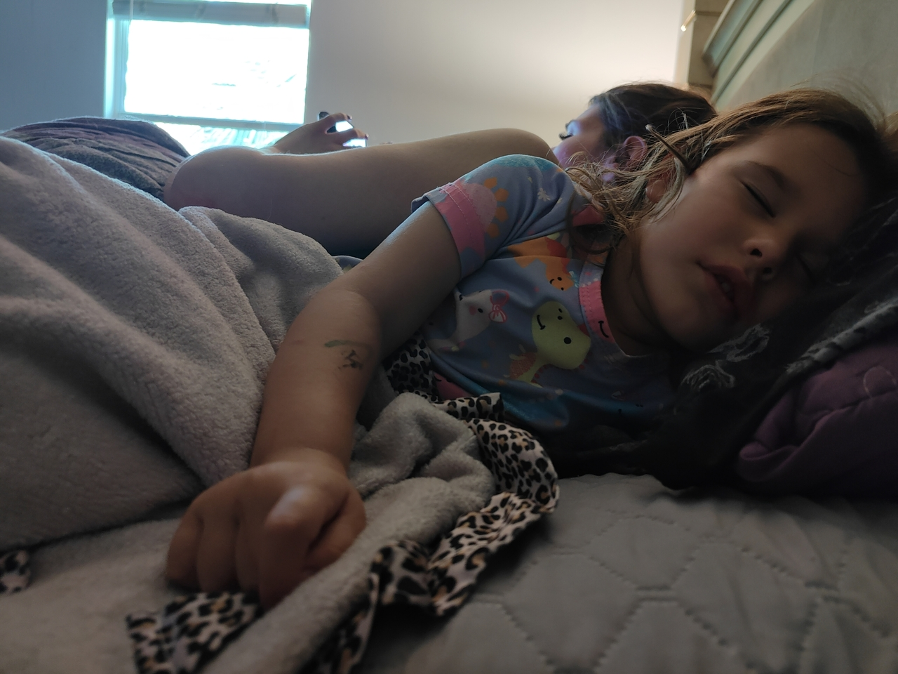
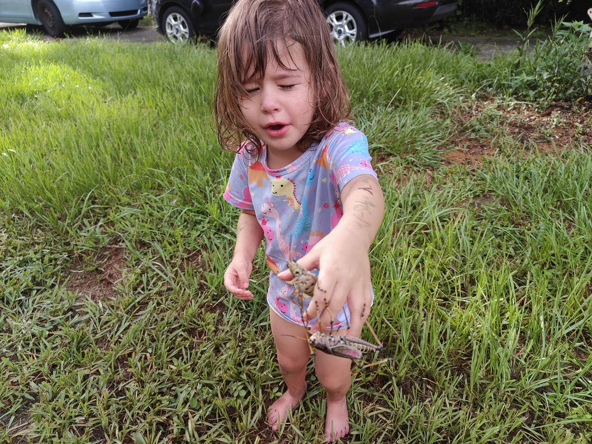
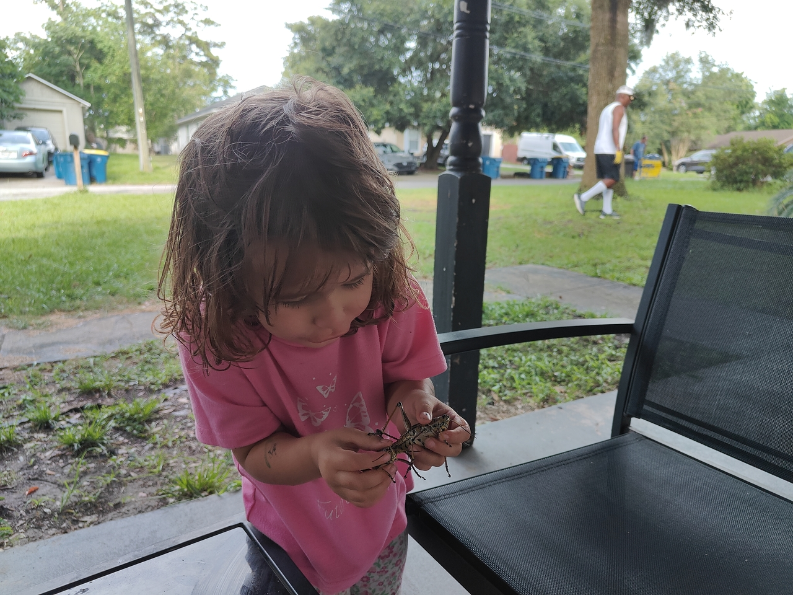

#+TITLE: June 28, 2025
#+INCLUDE: ~/org/blog/noumena/header.org
#+INCLUDE: ~/org/blog/image-preview-header.org

#+HTML_HEAD_EXTRA:<meta property="og:image" content="https://joshua-wood.dev/noumena/2025/june/28/sleeping-next-to-mommy-preview.webp"/>
#+HTML_HEAD_EXTRA:<meta property="og:image:alt" content="June 28, 2025 alt"/>
#+HTML_HEAD_EXTRA:<meta property="og:description" content="">
#+HTML_HEAD_EXTRA:<meta name="twitter:image" content="https://joshua-wood.dev/noumena/2025/june/28/sleeping-next-to-mommy-preview.webp" />

* Pancakes!

Noumena woke in a bad mood. I assumed that she was just hungry. Removing her overnight diaper was a challenge. It wasn't until I got her settled on helping me cook pancakes for breakfast that I calmed her down.

* Hanging Out At home

#+begin_export html

<iframe width="1547" height="548" src="https://www.youtube.com/embed/HY1AY_LA_0c" title="Loving On Chalmers" frameborder="0" allow="accelerometer; autoplay; clipboard-write; encrypted-media; gyroscope; picture-in-picture; web-share" referrerpolicy="strict-origin-when-cross-origin" allowfullscreen></iframe>

#+end_export

#+begin_export html

<iframe width="358" height="637" src="https://www.youtube.com/embed/AdAbsfddzI4" title="Playing With Purses At Home" frameborder="0" allow="accelerometer; autoplay; clipboard-write; encrypted-media; gyroscope; picture-in-picture; web-share" referrerpolicy="strict-origin-when-cross-origin" allowfullscreen></iframe>

#+end_export

* Going Outside To Look At The Wildlife

#+begin_export html

<iframe width="1559" height="548" src="https://www.youtube.com/embed/DktaWgv60s8" title="Playing In The Rain" frameborder="0" allow="accelerometer; autoplay; clipboard-write; encrypted-media; gyroscope; picture-in-picture; web-share" referrerpolicy="strict-origin-when-cross-origin" allowfullscreen></iframe>

#+end_export

* Nap Time

Noumena in her sleep, which cut her nap shorter than I was even going to allow. My poor baby was so tired she had a meltdown. It's been a while since she had that hard of a time. I changed her underwear telling her I would let her go back to sleep. She was trying to nap on the changing table but I hadn't yet put on her knew underwear. After I got them all, all bets were off.

Noumena didn't want to go back to sleep in Daddy's bed, nor her own, nor the changing table she was just trying to nap on. As usual, I sat there patiently waiting for it to end after all my efforts to calm her through satisfying her desires had failed. It took a surprisingly long time to subside. In fact, it didn't even subside as I sat there waiting for Noumena's bids for connection. Instead, something else upset her and my attention was just barely palatable enough for her to reach out hesitantly.

Since Noumena'd finally accepted being held---though, not without some resistance---I took her outside thinking that maybe the wildlife would be enough to snap her out of her frustration. I was right. We found two grasshoppers---one male and female---outside on one of the house's exterior walls. When they jumped out of my hands, she insisted on being the one to pick them up.

However, since I had been in such a hurry to get her outside, she remained only in the underwear I'd just replaced and a shirt but no shoes. I deliberated for a moment before placing her on the ground in her bare feet to catch the hoppers.

The mosquitoes began devouring Noumena's leg and I had killed several on her. So, I decided to get her in some proper clothing mitigating the bites. At this point, she was still excitable, so before we went inside to get dressed, I placed the grasshoppers on the wall where I knew they'd remain until we got dressed. I hurried her insisting that we had to do it quickly to get the grasshoppers when she repeatedly questioned the need for my haste. Shoes and clothes finally on, Noumena and I head out the door to resume our grasshopper investigation.

* Playing With Jeremiah

While Noumena and I were playing with the grasshoppers, Jeremiah had exited Ebony's front door. We noticed, Noumena---lubbers in hand---crossed the street to show Jeremiah her "best friends" as she had called them previously.

The poor boy seemed to have come down with a case of pink eye. Of course, I have no idea whether it was bacterial, allergic or viral, but for that reason, Ebony discouraged Jeremiah from handling our insect friends. He wouldn't have wanted to anyway, calling them "yucky" upon their revelation to him and affirming his fear.

Noumena---having forgotten that she too had once feared the lubbers---carelessly thrusted them at Jeremiah without an understanding of his trepidation. I had to remind her several times not to as we sat on Ebony's porch while I attempted to quell the worries.

Despite what I consider to be a lingering sexism, I did internally note that a girl---younger than this boy---bore no fear of large insects while /he/ bore squeamishness.

Jeremiah continually made efforts to distract Noumena from her preoccupation with the lubbers to engage in alternative forms of play. Eventually, I got Noumena to let the lubbers go in order to be more inclusive with Jeremiah. We took the hoppers over to a large tree, placing them on the trunk, to crawl, hop or climb away as they pleased so the play could proceed.

#+begin_export html

<iframe width="1559" height="548" src="https://www.youtube.com/embed/Z07dyi1gk5M" title="Pushing Jerimiah In Tricycle And Bumper Cars" frameborder="0" allow="accelerometer; autoplay; clipboard-write; encrypted-media; gyroscope; picture-in-picture; web-share" referrerpolicy="strict-origin-when-cross-origin" allowfullscreen></iframe>

#+end_export

* Bed Time

#+begin_export html

<iframe width="1559" height="548" src="https://www.youtube.com/embed/cpU9w7zCQRQ" title="Jumping Off The Bed!" frameborder="0" allow="accelerometer; autoplay; clipboard-write; encrypted-media; gyroscope; picture-in-picture; web-share" referrerpolicy="strict-origin-when-cross-origin" allowfullscreen></iframe>

#+end_export
