#+TITLE: August 24, 2026
#+INCLUDE: ~/org/blog/noumena/header.org
#+INCLUDE: ~/org/blog/image-preview-header.org

#+HTML_HEAD_EXTRA:<meta property="og:image" content="https://joshua-wood.dev/noumena/2026/august/24/photo/funny-face-at-dinner-request-preview.jpg"/>
#+HTML_HEAD_EXTRA:<meta property="og:image:alt" content="August 24, 2026 alt"/>
#+HTML_HEAD_EXTRA:<meta property="og:description" content="">
#+HTML_HEAD_EXTRA:<meta name="twitter:image" content="https://joshua-wood.dev/noumena/2026/august/24/photo/funny-face-at-dinner-request-preview.jpg" />

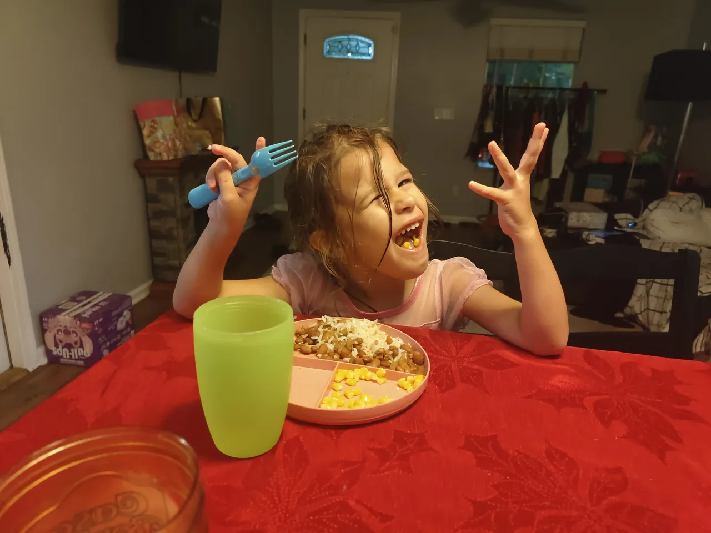

* Arriving Home

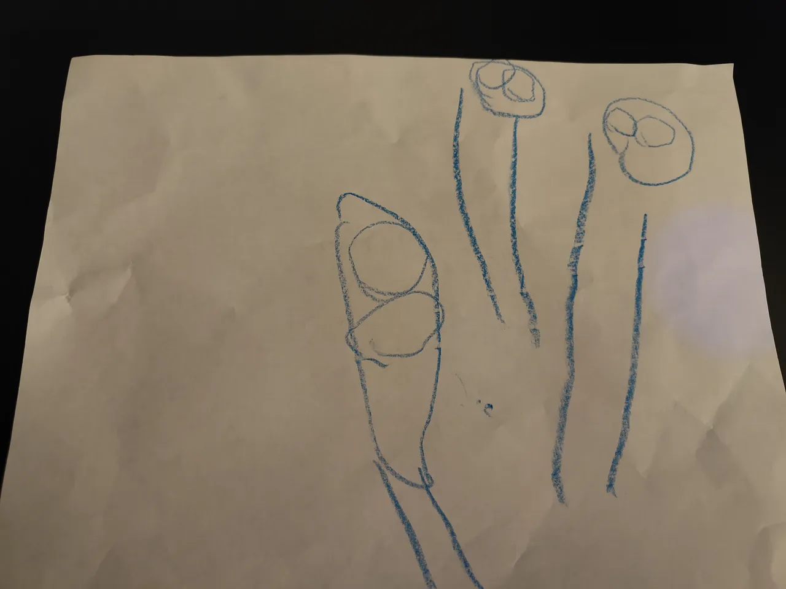

When Noumena gets home, the first thing she does is rush to show me a photo that she drew of all of us. She stops to look at it for a moment and then flips the page to ensure that I'm looking at the right one. And once she flips the page and sees the three figures, she points to them individually. First, she points to herself and she says, "That's me." Then she says, "That's mommy." And then she says, "That's daddy." I'm of course elated to see her expressing herself through art. Shortly after, she rushes out as hastily as she rushed in to see me so I finish up my work.

After I finished my work, I leave my office, and before I even see Noumena, she says, "Daddy," calling me to look at something she's watching on the TV. I can't remember exactly what it was that she was watching, but I know that whatever it was, we got distracted from it quickly and started wrestling on the bed and eventually started fighting. After I told her I was gonna punch her in the chest, we traded blows in the bathroom where I made fun of her for being present while I was peeing. And while we were wrestling and tickling and playing, I told her that I had to make dinner. And so I asked her if she wanted to eat rice and beans for dinner, and she ecstatically said, "Yes!"

* Pool Time!

I asked if Noumena wanted to go to the pool with me or if she wanted to help me cook she elected to play in the pool. I left and told her I had to clean the pool before she could play in it and proceeded to clean the film of algae that settles on the bottom of the pool after a couple of days.

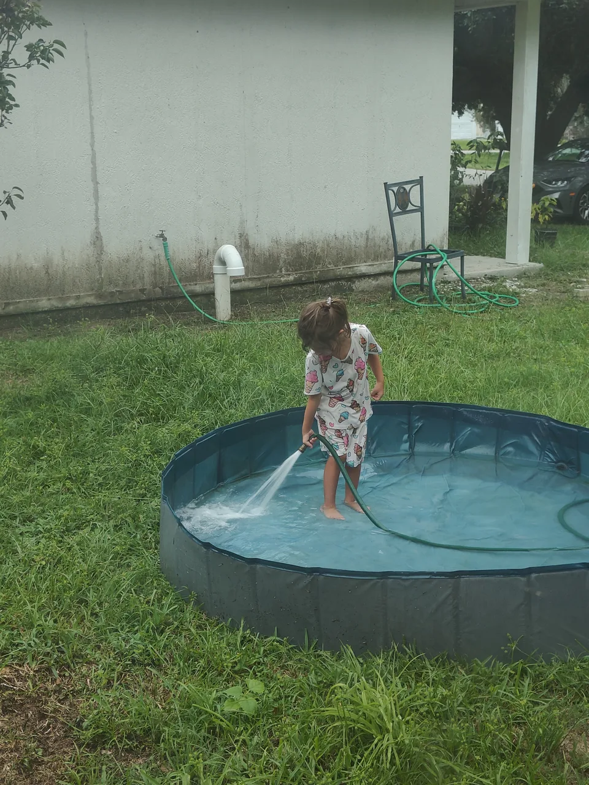

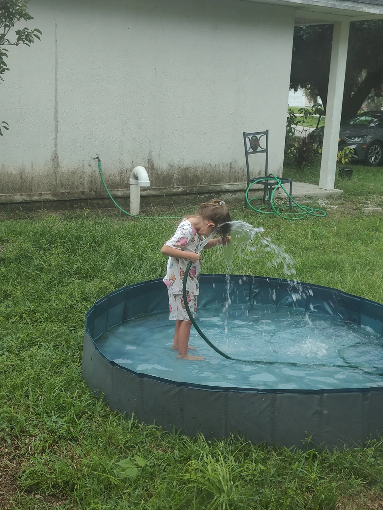

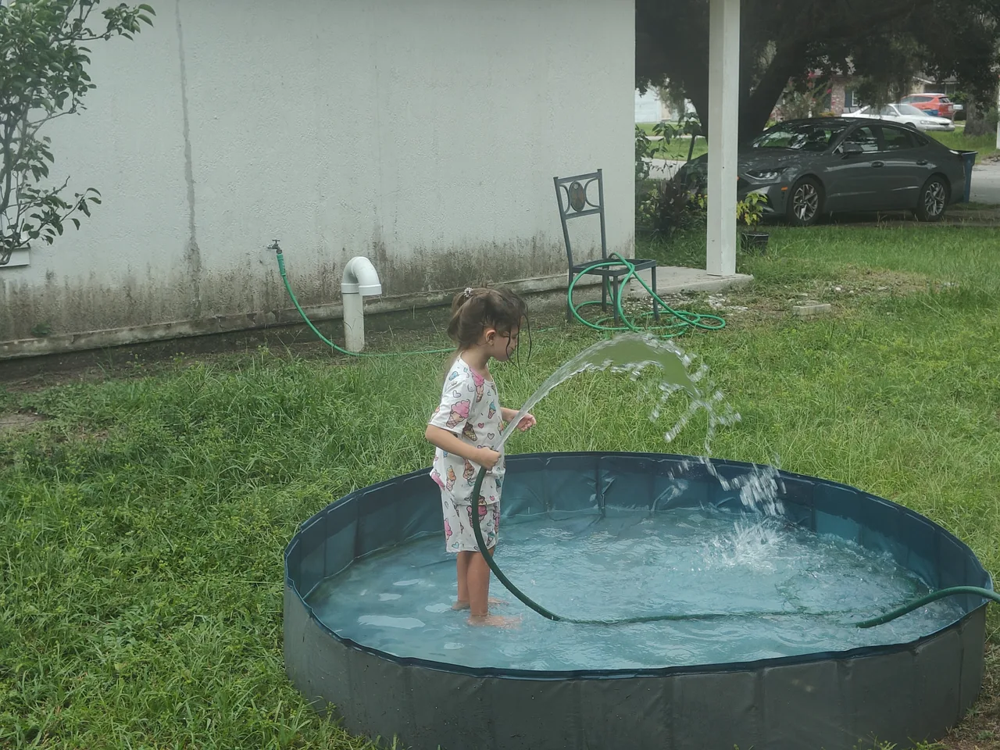

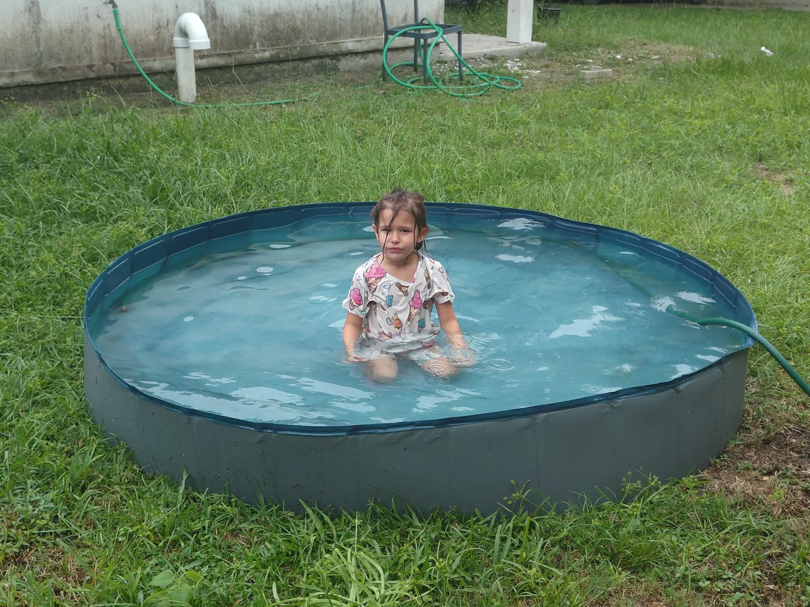

* Dinner

When dinner's finally ready and it's time for Noumea to get out of the pool, I lay down a towel. You can tell I've done this before because I've learned what creates the biggest mess and how best to mitigate it. Right as she gets on the towel I look at her feet and you can tell that they're dirty. So I tell her to go back and rinse her feet off. She very poorly attempts to follow the instructions with me barking "Only walk on the green parts on the grass, don't walk on the dirty mulch or the brown spots," Although I'm sure she tried her best, it was almost like she did it deliberately---walking right on to the dirty spots and getting it all over her feet.

I told her to go back and rinse her feet off in the pool and come back and walk only on the grass. I think there was some obstruction, something that she didn't want to walk around the grass for because she seemed like she was trying to avoid something---maybe the stickers. So I picked her up, walked out to the pool, and I dunked her feet in, and walked her right back to the house explaining how I was only walking on the grass.

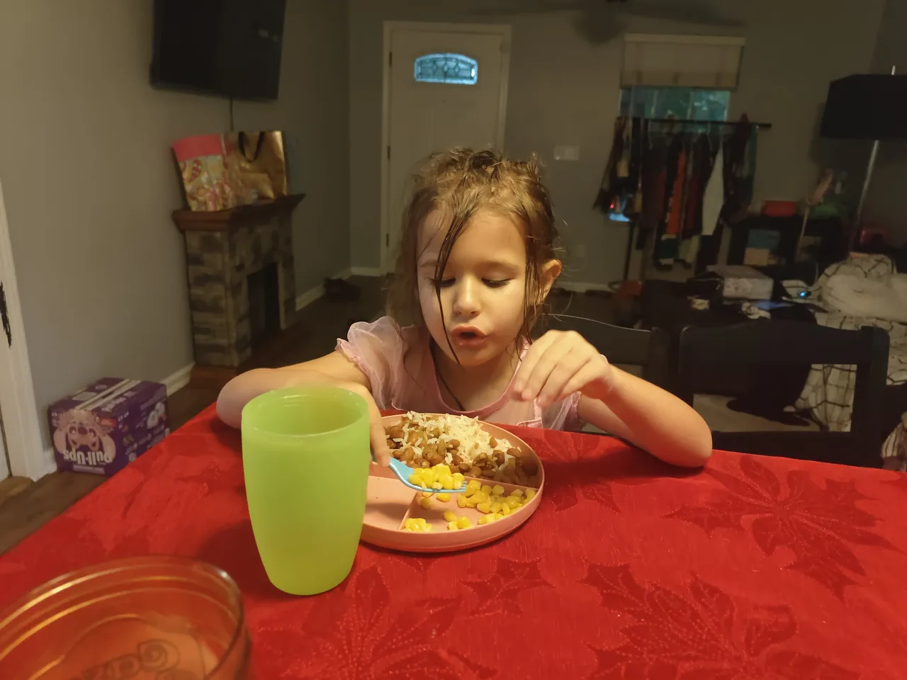

#+begin_export html

<iframe width="1879" height="689" src="https://www.youtube.com/embed/E18XfbnKqAg" title="Asking For A Video At Dinner" frameborder="0" allow="accelerometer; autoplay; clipboard-write; encrypted-media; gyroscope; picture-in-picture; web-share" referrerpolicy="strict-origin-when-cross-origin" allowfullscreen></iframe>

#+end_export

* Watching Spider-Man Into The Spiderverse Together

Recently I've been removing a lot of friction to make writing these entries easier. Because of that I went through a lot of internal conflict about the progress I've made, what this journal means, everything that's been going on, and the time that I've missed---the days I'll never get back---the backlog. Having removed so much friction, I resolved to do it today. A Spiderman quote came to my head from the /Into the Spiderverse/ movie,

"Alright people, let's do this one last time," Peter B. Parker says. That's kind of how I feel about starting this all up again and writing these entries. And since Noumena and I had already watched this movie together I thought why not watch it again with her tonight?

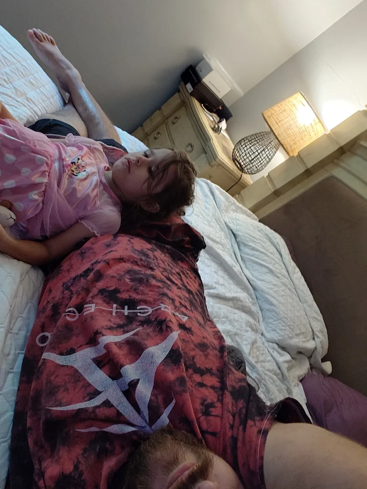

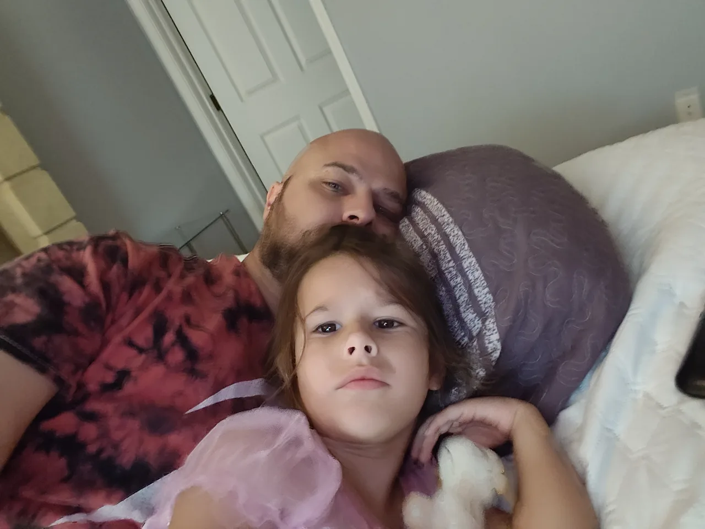

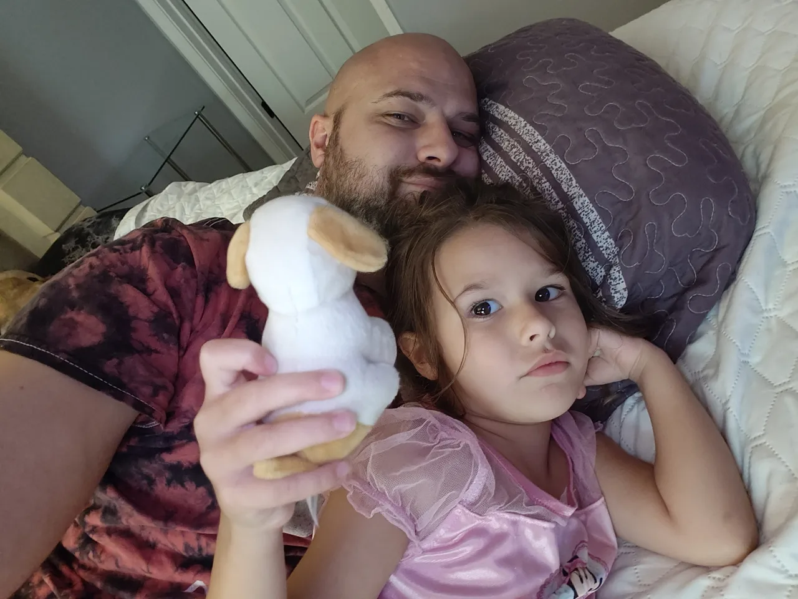

* Short walk
#+begin_export html

<iframe width="1879" height="689" src="https://www.youtube.com/embed/gkjZyKK41SU" title="Walking With Mommy" frameborder="0" allow="accelerometer; autoplay; clipboard-write; encrypted-media; gyroscope; picture-in-picture; web-share" referrerpolicy="strict-origin-when-cross-origin" allowfullscreen></iframe>

#+end_export

When we get back from the walk she wants to watch [[https://youtu.be/bp4_7T9J6Fg][birds for some reason.]] I let her. But, when it switches to something else and says she doesn't want to watch it, I turn off the TV. She's adamant about watching something. I thought fast and I asked her if she wanted to play "jail". Recently she's been really into it. That started maybe a week ago when I came up with it off the top of my head and it just turned into one of her favorite games. Unfortunately, it's not one of my favorite games. It's extremely repetitive. Nevertheless, it's remarkable how entertaining a four-year-old can find just complete repetition.

It's funny because Noumena's developed this thing where she says "pretend" to do something even if it's something that I actually need to pretend to do because I can just do it. Like "pretend you're not looking at me in the jail" for example.

The basic premise of "jail" is that I pretend to be working on something. I stuck in her head the first time I called it "doing my duty." Now she says "pretend you're doing your duty," then she comes out and touches me "sneakily" for me to turn around pretend like I'm like I'm perplexed by what's going on here. At one point I pretended like her short, quick touches were the wind. She thought it was absolutely the best, so she asked for it over and over. Today's iteration of "jail" actually included our cat Kiki. We put Kiki in the jail after having put Noumena's kid handcuffs on her. That didn't go too well seeing as Kiki doesn't have wrists, which we both found hilarious.

* Before Bed Playing

#+begin_export html

<iframe width="1879" height="689" src="https://www.youtube.com/embed/oLU_HGZlbMI" title="Messing With Kisa" frameborder="0" allow="accelerometer; autoplay; clipboard-write; encrypted-media; gyroscope; picture-in-picture; web-share" referrerpolicy="strict-origin-when-cross-origin" allowfullscreen></iframe>

#+end_export

A few days ago, we went to Dreamette to get ice cream. And while we were at the counter, there was this little rubber Jesus figurine. I asked the people at the counter if that was decor, but they said it wasn't. So, after Noumena asked if she could have it, I just said she could take it. It was sitting there while Noumena was playing next to her bed, so I stood it up, faced it towards her and said, "Jesus is watching you". Noumena, apparently offended by this prospect, repeatedly came over to knock Jesus down. Hilarious.

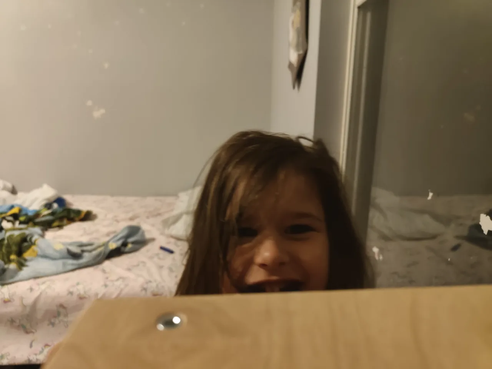

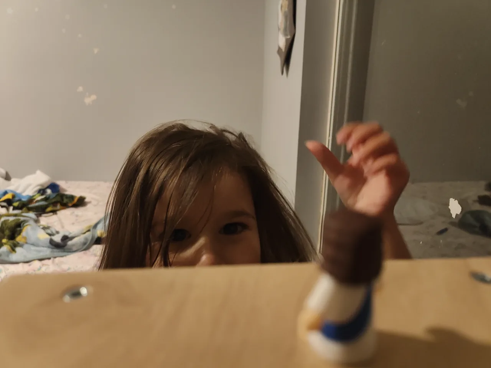

* Bed time

Bedtime approaches, but she already wearing her pajamas---she'd been wearing them since after she got out of the pool. It's about 8:15pm---still before her nightly "get ready for bed" timer goes off. I gave her a piece of chocolate, but just as she begins to eat it, her mom invites her to read a book they had discussed on the drive home when her mom picked her up from daycare. They read /The King The Mice and The Cheese/.

Noumena's timer went off before they finished reading. I hit the 5 minute snooze since all that was left was the diaper and brushing. When they were done, they both came to the living room in conflict over her cleanliness from the chocolate. Amidst that conflict---because teeth brushing loomed ahead---I initiated a conflict of my own saying, "You're still eating the chocolate? Why didn't you finish it? Quick! Eat it fast!"

Bed time tonight has a little bit more friction than usual. I guess I'm to blame because a sense of uneasiness or anxiety from the blankets constantly strewn across her room had me asking her what she wanted done with them. She never likes to keep them on her bed. They're only used for play, so they're everywhere and it looks really messy. I started asking her whether she wants to keep her red owl blanket or does she want to get rid of it. To my surprise, she said that she wants to get rid of it! I said, "you mean you're okay with your mom selling it?" She affirmed. I was shocked. I asked her about her owl quilt. I really didn't want her to get rid of it. Thankfully, she said she wanted to keep it. But then she began playing with it---folding it over, laying it down. What had I done!?! I had to start this right as it was time for her to get to bed! What was a mistake.

I asked Noumena, do you want to go straight to bed, or do you want me to read you a book? She picked a book, but couldn't concentrate on reading it since she was so distracted playing with blankets. I told her, "I'm just gonna leave if you don't want cuddles." Finally, she asked for cuddles, but it was very much begrudgingly. It was very push-pull. Eventually, I get her to settle down with some cuddles for 3 minutes. I asked if she wanted tucked in before leaving as I usually do. She said she didn't, and so I left her saying I loved her as I closed the door.

Goodnight, my sweet cherub. I'm excited to see you in the morning.
