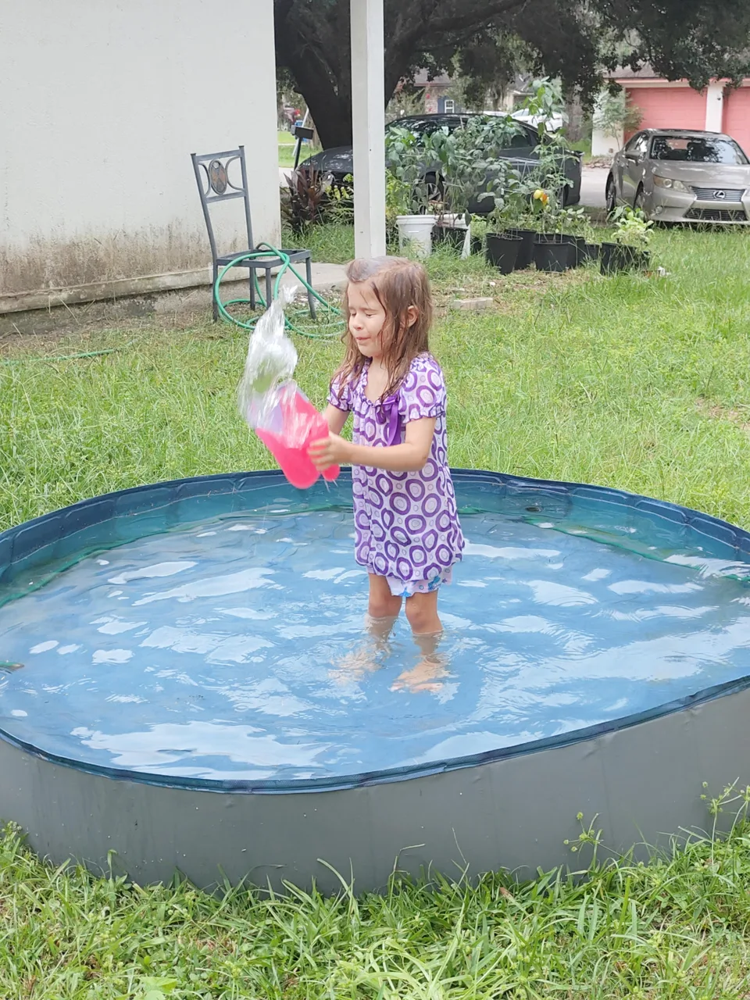
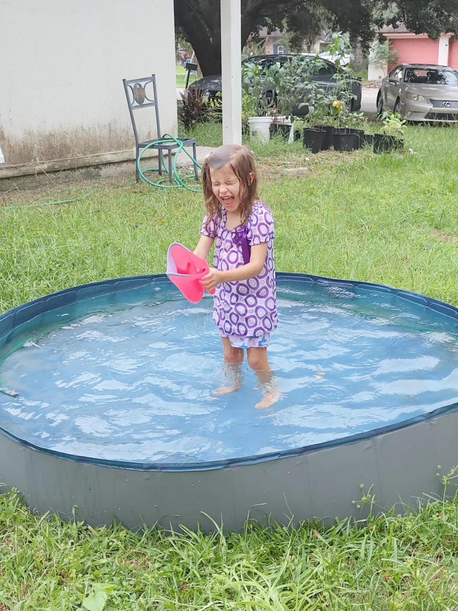

#+TITLE: August 25, 2026
#+INCLUDE: ~/org/blog/noumena/header.org
#+INCLUDE: ~/org/blog/image-preview-header.org

#+HTML_HEAD_EXTRA:<meta property="og:image" content="https://joshua-wood.dev/noumena/2026/august/25/"/>
#+HTML_HEAD_EXTRA:<meta property="og:image:alt" content="August 25, 2026 alt"/>
#+HTML_HEAD_EXTRA:<meta property="og:description" content="">
#+HTML_HEAD_EXTRA:<meta name="twitter:image" content="https://joshua-wood.dev/noumena/2026/august/25/" />

* Good morning, little cherub!

I can't remember how a Noumena woke me up this morning, but I feel like the first thing she said to me was, "Daddy, can you feed me?"I asked her what she wanted, and I think she said Rice Krispies. That's what I ended up getting her, but we didn't have any soy milk, so I begrudgingly had to use cow milk. I didn't feel great about it at the time. After she ate, I asked her mom if she could take her to school, and she said she could, but then Noumena insisted that I take her to school, and so I told Noumena, "All right, but if you want me to take you, you gotta get dressed fast." So I told her to go pick out her clothes. When she went to go pick out her clothes, she picked a purple blouse and these pants. I remember her saying specifically that she didn't want to match, and I said, "Okay, kid. It's up to you."Not only did she insist that I take her to school, she also insisted that I carry her to the car. And so I did.

When Noumena and I were on our way to her daycare, I can't remember all the questions that she was asking me, but at some point she asked me to tell her a story. I asked her what story she wanted me to tell and she told me what about the zebra and the skeleton. She had come up with this story previously when we were driving to the zoo. At that time, she was the one telling me the story. I did my best to recount the story. I put a unique spin on the story---it similar to the one that she had told. It was about a zebra who saw a scary skeleton. The scary skeleton started chasing the zebra! When the skeleton got close, the zebra kicked the skeleton. The skeleton exploded into a bunch of different pieces but then magically reassembled and started chasing the zebra again. I can't remember the exact ending, but I had it resolved to have a happy ending where the zebra and the skeleton went to like a castle or a palace or something together and got along.

* Dinner

Noumena's mom picked her up from daycare today. I was already off work when she got home, so the second I heard her walk through the door, I ran to greet her. She came to me with a sticker and tried to stick on my shirt. It had lost all the adhesive and so wouldn't stick. Picking her up I told her it wouldn't stick to my shirt. She tried to stick it to my head.

While still in my arms, she started saying she wanted to watch a Jack. Confused and surprised, initially thought that she was talking about the movie Jack with Robin Williams. We had tried to watch it some time ago, but at the time she couldn't pay attention to it. Her mom informed me that she was talking about Jack and the beanstalk. She repeated the query---asking me if she could watch it. I decided to let her since I had to cook anyway. I needed to use up the pasta sauce.

When dinner was finally ready, Noumena, peeking over to top of the table, said that pasta---the pasta with generic red sauce from a glass jar---was her favorite pasta. I took a note of that. She ate three servings---three whole platefuls of pasta. She was really ravenous. I had already finished eating dinner and sat at my computer to do a little work. Despite having already planned to go to Arlingwood park, she asked me if she could go in the pool. I protested, "I thought we were going to go to Arlington Park?" She said, "no, I want to play in the pool." I told her she could.

* Playing In The Pool

Just before getting into the pool, she asked if she could bring her bath toys out there. I told her yes on the condition that she cleaned them all up before she came in. I got her total commitment clean them up before she could go in. She agreed.

#+begin_export html

<iframe width="1879" height="689" src="https://www.youtube.com/embed/iXuuEEFR-3s" title="Playing In The Pool" frameborder="0" allow="accelerometer; autoplay; clipboard-write; encrypted-media; gyroscope; picture-in-picture; web-share" referrerpolicy="strict-origin-when-cross-origin" allowfullscreen></iframe>

#+end_export

I was a little bit eager to get back to my work when she started playing in the pool because I knew that she would be occupied there by herself. But before I left, she asked me if I would come in the pool with her. And so I deliberated. And what I was deliberating was something that I had been thinking about the last couple of days, which is the mentality around archiving these interactions and keeping them and preserving them for her could come into conflict. With being totally present with her. And so because I had been remembering this, I decided to get in the pool because I got in the pool. I set my phone down, couldn't record anything. And just jumped in the pool with her.

It ended up being a good decision because she initially started playing by throwing the toys she had brought from her bath into the green bucket that she brought them in. And at some point I noticed after having thrown her in the pool a few times from her hopping on me, I noticed that we could make a game out of throwing her bath toys into the bucket. And we came up with rules on a fly. And the rules we came up with ended up being like there were six total floaty toys. And we each started off with three. And when she would throw, when one of us would miss, the one that we miss would go towards to the other person and they would have an opportunity to make it. And so if you made four, first person to four, one. And if each made three, then it was a tie. And we must have played that 20 times.

Regardless though, at some point, I didn't want to play anymore. And Noumena asked me if she wanted, if she could just... At some point Noumena asked me if I could set a timer. And I said I can't set a timer because I didn't have my phone on me. And so I said what I could do is I could count. And she asked for two minutes. So I sat there in the pool while she was playing and I counted to the best approximation of a second each interval until I reached 120 and I said it was time to get out. Getting out was its own little fight. Because I just wanted her to stay. I was so mad because I had to clean out the pool. And she just kept running around. And it's the problems, the annoyances, things like that that make it all worth it.

* Shower time

I came prepared before I ever got in the pool I sat down the towel right at the doorway and two towels on the side just because I knew I was getting in so I prepared another towel and I told her we had to shower only because we had been swimming in one day old water and it made me nervous so I wanted to make sure that we shower right after we got out so once we got inside we took off our clothes right on the towel and I wrapped them in the towel it was the cleanest way to do it and I wrapped a towel around us and I put the dirty clothes in the washing machine and had her navigate to the bathroom while her mom was working.

The shower was draining slow and Noumena said that she wanted to continue playing and so I just turned on the bath faucet instead of the shower faucet and got out and God rest myself while she continued to play in the tub. That gave me an opportunity to get some laundry done. While she was playing and I told her when I turned the water off the bath faucet off that she had this opportunity to I told her that she had until the bath that was drained to play then when it was drained I was going to she had to get out.

* Watching /Lilo and Stitch/

I had gotten Noumena's pajamas ready. I brought them in and showed them to her while she was still bathing and had her pick. And so I had them ready, but she recently got stitch pajamas, or not stitch pajamas, she had recently got stitch diapers or stitches, love interest, angel diapers. She was on the bed for when she was ready to get out. When she got out, she was very intrigued by Angel. So I asked her if she wanted to watch Lilo and Stitch. She said yes and we sat and watched her almost up until her bedtime. Well, up until she had to brush her teeth.

* Bed Time

At bedtime, I asked her if she wanted me to read a book. She said yes, and I asked her which book, and she told me she wanted me to read The Kingdom, Ice, and the Cheese. So I laid on her bed with her and read it to her. After that, I got up to leave, and she was very eager to have her come. I set a two-minute timer, and we laid together and cuddled for two minutes. I left to sit back in my office and work a little bit while she was in bed. A few times, she got up and asked me if she could. I gave her a few more cuddles just to make sure I set another two-minute timer. and cuddled her for that two minutes. And after that, she fell asleep. I'm excited to see you tomorrow.
