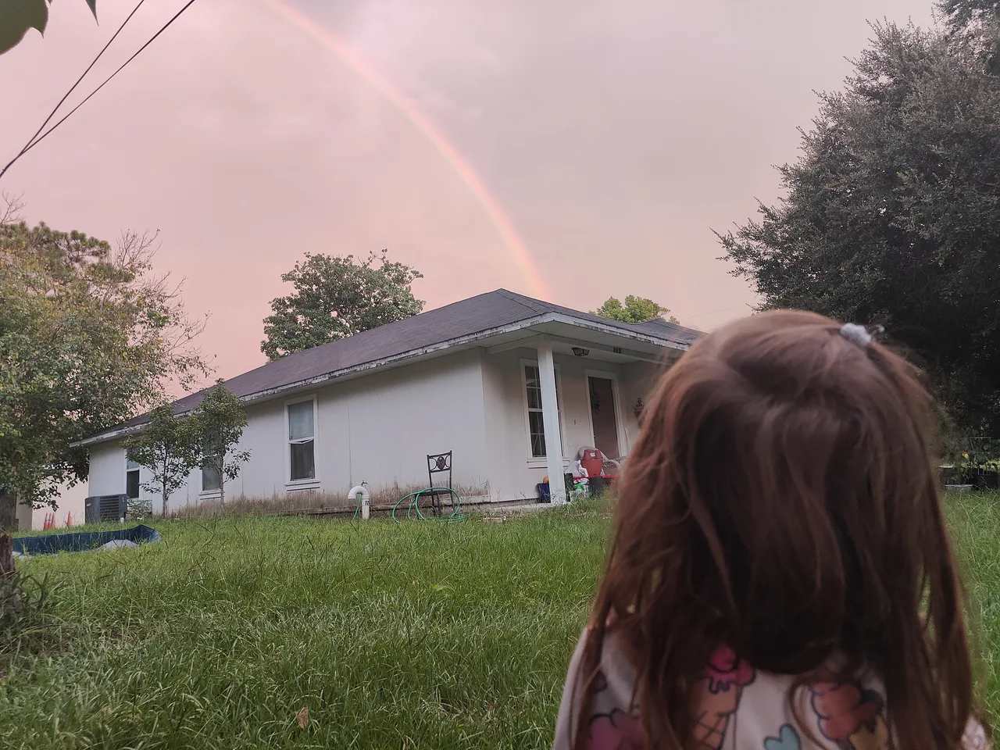
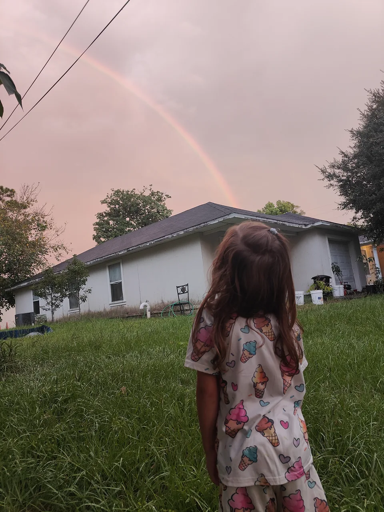
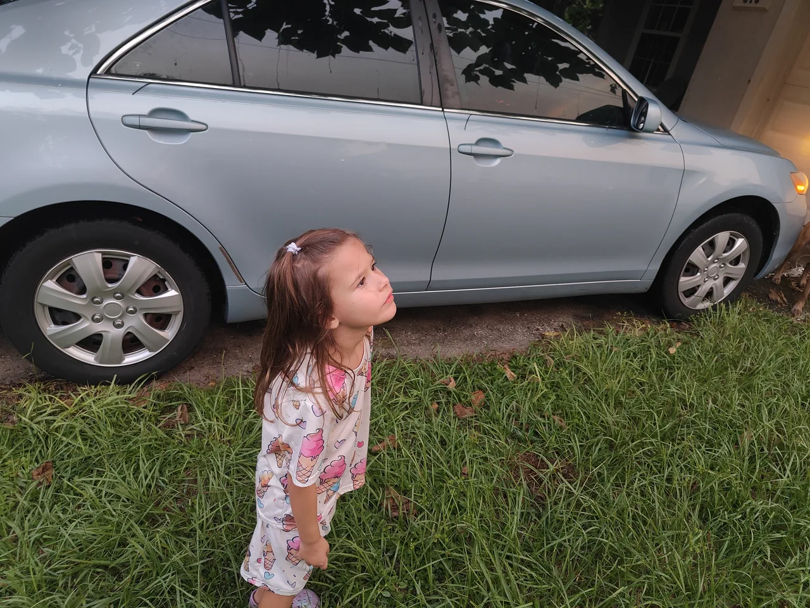
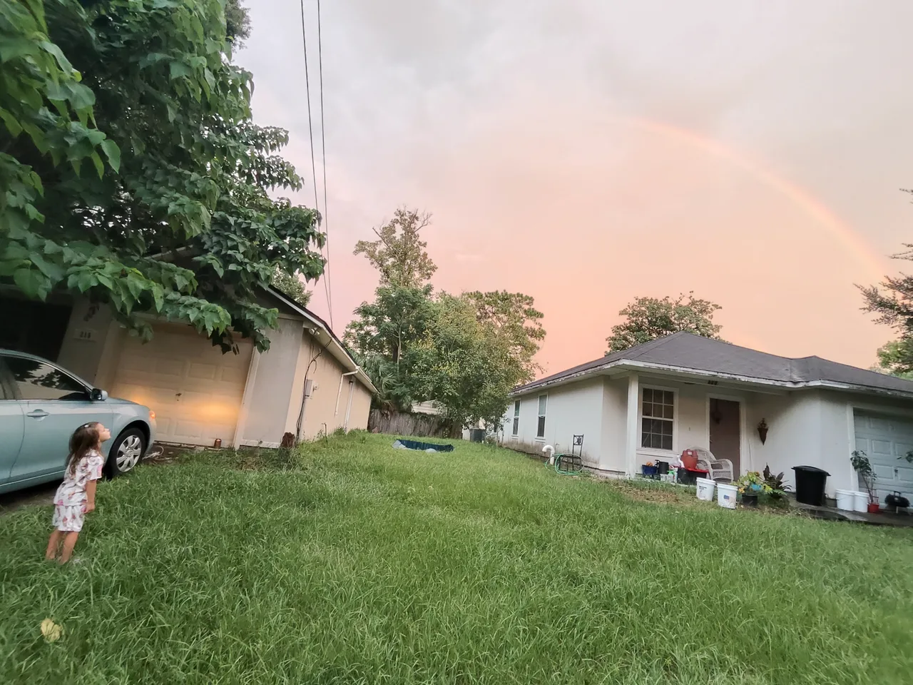
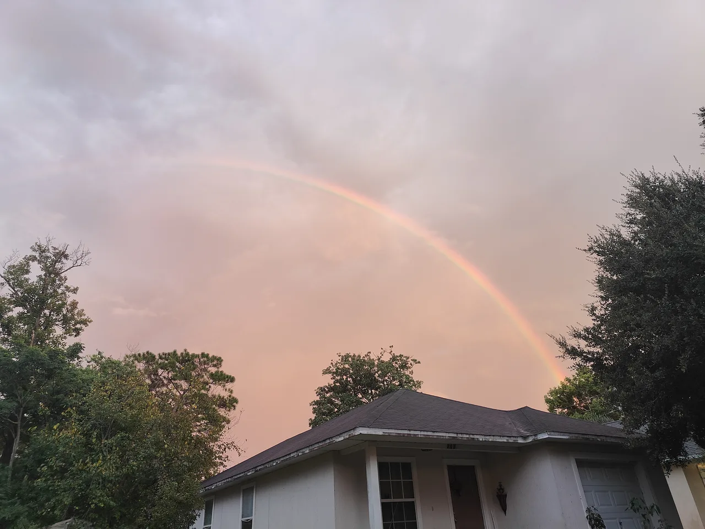
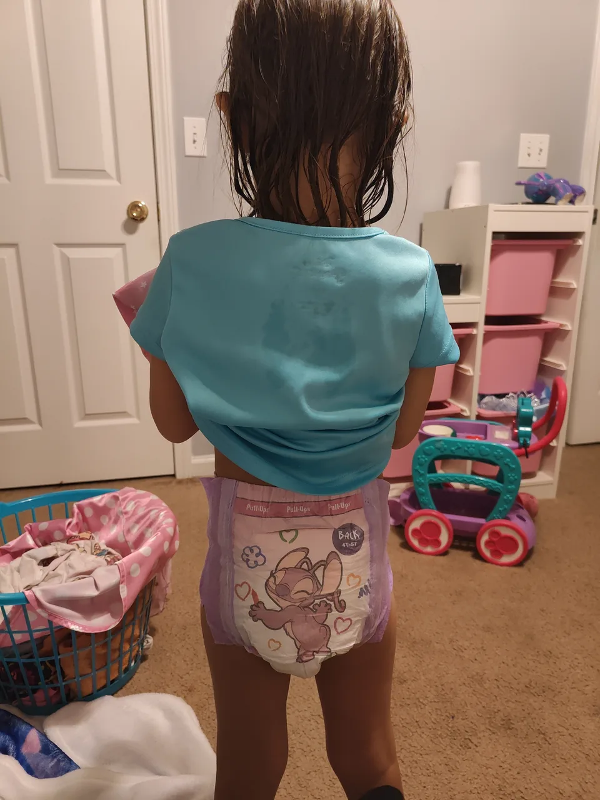

#+TITLE: August 26, 2026
#+INCLUDE: ~/org/blog/noumena/header.org
#+INCLUDE: ~/org/blog/image-preview-header.org

#+HTML_HEAD_EXTRA:<meta property="og:image" content="https://joshua-wood.dev/noumena/2026/august/26/photo/rainbow-watching-1-preview.jpg"/>
#+HTML_HEAD_EXTRA:<meta property="og:image:alt" content="August 26, 2026 alt"/>
#+HTML_HEAD_EXTRA:<meta property="og:description" content="">
#+HTML_HEAD_EXTRA:<meta name="twitter:image" content="https://joshua-wood.dev/noumena/2026/august/26/photo/rainbow-watching-1-preview.jpg" />

* Good morrow, sweet child!

The very first words I hear upon waking up are "Daddy, I pooped." Noumena was asking to use the bidet. I thought ahead and discerned this would be a perfect opportunity to get her dressed quickly. I told her that she could use the bidet, and I hoisted her naked body onto the toilet seat to use the extension. Swishing her back and forth, I made sure to get her all clean.

When Noumena was done, I told her to put on some underwear. She went into her room, got a pair of Unicorn underwear, came in to show and describe them to me and put them on. Of course, they ended up backwards. I informed her of the little mishap and directed her to take them off and try again---the right way. Opening the torso piece and pointing with my fingers, I showed where the tags were and explained that's how one knows what "backwards" is.

I had left Noumena's Ice cream outfit (consisting of matching shorts and a T-shirt) out from when I had folded them while she slept last night. Since they were close and convenient, I asked if she just wanted to wear that outfit. She agreed, so I turned it into a developmental challenge---asking her if she could do it all by herself. I told her if she could, she'd be a big girl. She responded, "I think so." And proceeded to do it by herself.

Once I get her dressed She asked if she can watch the birds dancing I was referring to the YouTube video birds for some reason and it's sequel more birds for some reason So I turn that on and watch that with her And then when it's done turn it off immediately and I asked her if she ate She said no So I said, okay. Well, let's just get ready to go then And because I said let's get ready to go That she decided that she wanted to eat so she could spend more time at home. So I fed her rice krispies with milk try to brush her teeth or try brush her hair while she was Eating but she didn't want to let me she was mad about The me brushing her hair so she just said I won't eat until you're done So I started putting up her ponytail when I was putting up her ponytail She said you're taking a long time After that while she was eating asked her she wanted to be 12 and she said Yes, so I gave her that And After that I went to the restroom myself When she came in to see what was going on so I told her to go put her shoes on and she did And when I came out of the bathroom, I realized that they were on the wrong feet So I wrestled her down Where she was on the right feet And as we were leaving out the door I gave her her gummy multi vitamins and She told Jasmine that She could come with us And so we headed out to the car.

As we're driving to daycare Noumena has said that's how the world works and so I I don't remember what she was referring to and she said that but I started singing the song by Bo Burnham and she asked to listen to it so I started playing it in the car and she asked if she could see so I held my phone behind the headrest of the car seat and while I was driving and she watched that video so I continued to sing it after it was over and she asked I sang the part where I said the FBI killed Martin Luther King she asked who Martin Luther King was and so I told her that he was a civil rights activist probably the most famous civil rights activist and he was responsible for or at least he played a key role in her being able to go to school with her black friends and she told me to tell her story about it and so I said for a while the world was such a best place that you weren't allowed to go to school with your black friends and so he helped make it so that you could go to school with your black friends and I asked if she wanted to see that I have a dream speech she said she did so I started playing it but then I realized you know might not have been such a good idea because she's no context he talks about the Negro in that speech a lot and she goes to school with a lot of black children so and even a lot of the workers are black so I realized after the fact that it may not have been the most true the thing to show her even if my intention was good.

* Daycare

When we pull a stake here, Noumena doesn't want to get out of the car section like she's tired. So I prompt her to get out, and she does. Then she demands that I pick her up. So I hoisted her over my shoulders and closed the car door and walked her into her chair. She does not want me to go. She really wants to stay with me. She's sad. You can see the sadness on her face when I'm about to leave. I hate that. I hate that they have her do that, but whatever. Anyway, I told her to have fun. I told her to promise me. And she said, I won't have fun. And I turned her around, and I shook her, and I grabbed her, and I said, you have fun with your friend. And Autumn had walked up to her at that point. And so I walked her towards Autumn. And I said, you have fun with your friend. And I left. She had to give me one more hug. And I said, goodbye. I love you. See you soon.

* Noumena's Home!

When Noumena got home, I had planned this whole dinner out. But I didn't have onion, I thought I did. But what ended up happening is I just made the Beyond Meat and I started to eat it and I liked it so much that I just kept munching on it. The second Noumena got home, I offered her some and I thought that she was going to like it as much as I did but she didn't like it at all. She spit it out and threw it at me. I don't know why she throws food. And it landed back on a plate so I just ate it, I didn't care. So I was a little concerned but her mom had already planned to have her or make hamburger help her so she asked Noumena if she wanted the Noumena said yeah but she wanted to watch Hercules. So her mom set her up with Hercules on the TV. And since the Beyond Beef was all mine after that, I wasn't complaining. I came in after I had finished my dinner and just sat with her and started watching. I demanded cuddles immediately. But she couldn't sit still with it. Her mom came in periodically, she said this was a boring episode. While she was cooking she would take breaks and come in and say this is like an episode with no monsters and that Noumena wouldn't like it.

like I said it didn't last long though we just ended up wrestling and I like this thing that I started doing because she landed it a few times where I would throw her from a standing position on the floor to on the bed and she'd land a few times I don't know why I like that doing that so much but at one time when her dinner was ready I was trying to get her to jump off the bed and not be afraid to jump off because I guess she was kind of afraid jump on the floor but she wasn't afraid to jump on to Jasmine's bed so I didn't really understand so I was trying to get her to jump on the floor so I told her you couldn't get off the bed until she jumped off onto the floor and she just turned that into a game where she's trying to get off the bed and I wouldn't let her off the bed and she would run to the other side of the bed but she couldn't jump off obviously because she was scared so I jump on the bed and grab her for if she could just she could slide off and wouldn't let her go but eventually I let her go and eat her dinner

At some point, I can't remember why, but I had the idea of going to Arlingwood Park with Jazz. I think she said she didn't want to go. But I had been like, I think the reason I wanted to go was because I had been feeling bloated or something. And it's like, I was laying on the ground with my butt in the air and doing climbs on me and starts using me. But yeah, since my stomach wasn't uncomfortable, I just wanted to get up and move around. So I asked her if she wanted to go to Arlingwood Park. And she said yes. So I got in the car. And on the way there, she wanted to listen to "How the World Works" by Bo Burnham again. She really liked that. She thought it was funny. The soccer gets ripped off Bo's hand. It's hilarious. So we listened to that a couple of times, literally two times on the way there because the traffic was a bit, or the lights were a bit slow.

#+begin_export html

<iframe width="1879" height="689" src="https://www.youtube.com/embed/WW_aJGDNIu8" title="Using Daddy As Slide" frameborder="0" allow="accelerometer; autoplay; clipboard-write; encrypted-media; gyroscope; picture-in-picture; web-share" referrerpolicy="strict-origin-when-cross-origin" allowfullscreen></iframe>

#+end_export

* Arlingwood Park

When we arrived at Arlingwood Park we brought Jasmine with and I got her on the leash and Walked up there and right away this boy comes up to us and asked if he can pet our dog He had these blue sonic shorts. I can't remember his name. It's like JJ or something But yeah So we were playing with that little boy and then at some point the little boy got separated from His father and it was just me and Noumena and Jasmine all playing with this boy in his soccer ball Noumena was picking up and throwing and I was telling her to Use it to kick it and she wasn't listening and then the boys started throwing in his own soccer ball And I couldn't get rid of Jasmine so eventually I asked if I can tie Jasmine up and I said no, but I can put her in the car John put her in the car and Noumena said yes, we walked back to the car to put Jasmine in And When we came back We started playing in the field with that boy again, but There's a lot of there's a lot of people there So we kept getting distracted at some point. We were running around playground. She wanted to play dinosaurs and then she changed her mind about playing dinosaurs once we started acting like dinosaurs, then she wanted to play Jack in the beanstalk and I I Played the giant for a little while It's funny at some point The one of the kids one of the the kids dads and the kid and his kid were swinging on the swings and someone told him to do like a backflip and He said he couldn't do it off the swing he said he was too tall and So I'm giving this dad a little bit a hard time I was like, oh, you know a man of your stature should be able to do it or whatever Just pick it on this this dad and He said he could do it on the ground and I said, oh, yeah, let's see it we Me and the rest of these kids ended up peer pressure in this dad and attempted to do a backflip And When we pressured him into doing a backflip he messed up his knees.

Eventually, there was only one little girl left. We had played with her just a little bit when I was chasing some of these other kids and playing with some of these other kids. There was a little girl named Liana. When everybody else left, it was just her. She's eight-year-old. It's very funny, because Lumina wanted to get on-- I don't know how to describe these swings. They're not like tar swings. But they're circular, and they're large, and multiple children can fit on them. And so Lumina wanted to get on. So we got on, and then Liana was like, can I go fast? And I was like, yeah, you can go fast. So I started asking Liana questions about herself, how well she was. She had me guess what grade she was in. So I guess third grade at first. I went a little high, and then I was wrong. And so I guess fourth grade, because I've been wrong about that before. And I thought the kids were too young when they were older. But she said that she was in second grade. I was a bit surprised by that, because I was in third grade. So I was a bit surprised by that. But she said she was in second grade. And when I was asking her questions, she was just like, you asked too many questions. And then she asked me to-- she got off that swing and got on the spinner. It was cold. And she was asking me to spin it. And I said, no, not unless you answer all my questions. I can't remember what the questions were. I just remember what her answer was. She said she didn't know. And I said, that's an acceptable answer. And then I spun her a new one, and I spun it really fast. After that, Noumena and Liana got on the swings together. And at first, Liana turned everything into a competition. Liana was talking about how Noumena was her sister now. And I said, well, that makes you my daughter. And she's like, I'm not your daughter. It's just this crazy, very interactive kid. A lot more interactive than a lot of kids. And she was swinging at me. And I was dodging. And she was just having an absolute blast with me and Noumena. But eventually, they had to go. And Noumena had to go shortly thereafter, too, because her feet were getting all dirty. She was hanging on the swings on her stomach. And she was barefoot, because she was copying Liana, who was already barefoot. And so eventually, I just picked her up, and I said, we got to go. I took her over to the bench, because she was resisting a little bit. So I took her to the bench, and I put her shoes on. And I told her that the reason was because her feet were all dirty. And we had to make sure she took a bath, because internally, I was kind of worrying about her having dirty feet and getting her sheets dirty.

But the best justification came from a true one which is at some point I remember that the dog was in the car and I was like man we gotta you know make sure the dog is okay and take her home and on the way home we listened to how the world works twice again she likes that song so much and while we were driving a rainbow showed up in the sky so I pointed at it and I told her I was like can you see it she had struggled because of the angle and eventually she did see it and when we got home she got out and it was in clear view right right outside our driveway and she stared at it for a good long time long enough for me to get quite a few photos and then we went inside and it's funny enough that I had her keep her shoes on normally I have her take them off but because her feet had gotten so dirty I told her to keep them on until we got to the bathroom because I thought the bottom of her her shoes were actually cleaner than the bottom of her feet

#+ATTR_ORG: :width 50%

#+ATTR_ORG: :width 50%

#+ATTR_ORG: :width 50%

#+ATTR_ORG: :width 50%

#+ATTR_ORG: :width 50%

* Bath Time

For her bath, I just cleaned her real quick shampooed her, conditioned her, and scrubbed her. And then I told her, since it was approaching her bedtime, I said, "You only got three minutes." And so I let her play in the bath by herself for three minutes after having broth or toys in there from my bathroom. That was for three minutes until she was ready to get out. And then she was giving me a hard time about picking her pajamas, so I went ahead and picked them for her.

She's really interested in Angel from Leo and Stitch. I have to figure out where they're from so we can watch that movie together or that show whatever Angel is from. But she's examining her diaper and she's seeing that Angel is hugging Stitch. She asked why they're hugging and I said well they're just conceived of as the romance. And then she asks or she shows the backside and she's like it's crazy how they did this with these diapers. They made Angel hug her butt so I said they made Angel look like she's hugging the child's butt and so I took a picture so I could show Noumena that it looks like Angel is hugging her asshole.

#+ATTR_ORG: :width 50%

* Tigran-ception

After we got Noumena ready for bed with her pajamas and diaper, she wanted to watch videos of when she was a baby because I've been doing these journal entries and I set up this application that allows me to find all the old videos and navigate them real quickly and really increase my ability to do these journals with less friction and so she's been kind of witnessing this in the background and she's been asking me all the time to see baby videos when she was a baby. One video we landed on was her watching Tigran and so she asked me if she could watch Tigran play Levitation 21 because that's what was going on in the video so I said yeah and so I started filming her because I was on her computer and I had been doing this thing I took a video of her watching Tigran but then I sent it to my computer and so I could watch it immediately on the computer and so I had her watch the video of me filming her watching Tigran and then while she was still watching that I sent that video to my computer and I had her watch a video of her watching a video of her watching Tigran.

#+begin_export html

<iframe width="1879" height="689" src="https://www.youtube.com/embed/Xur-Oca_UB4" title="Watching Tigran By Request" frameborder="0" allow="accelerometer; autoplay; clipboard-write; encrypted-media; gyroscope; picture-in-picture; web-share" referrerpolicy="strict-origin-when-cross-origin" allowfullscreen></iframe>

#+end_export

#+begin_export html

<iframe width="1879" height="689" src="https://www.youtube.com/embed/fvEnbhkcdL8" title="Tigranception 1" frameborder="0" allow="accelerometer; autoplay; clipboard-write; encrypted-media; gyroscope; picture-in-picture; web-share" referrerpolicy="strict-origin-when-cross-origin" allowfullscreen></iframe>

#+end_export

#+begin_export html

<iframe width="1879" height="689" src="https://www.youtube.com/embed/RRPfBk0MgC8" title="Tigranception 2" frameborder="0" allow="accelerometer; autoplay; clipboard-write; encrypted-media; gyroscope; picture-in-picture; web-share" referrerpolicy="strict-origin-when-cross-origin" allowfullscreen></iframe>

#+end_export

* Bed time

It's becoming tradition for a Noumena to ask for her mom to read her a book before she goes to bed and So the book her mom chose to read her today was are you my mother and while that was happening I Has still been feeling gassy. So I was like laying on the floor Trying to recover while they're in the room reading the book together And when her mom was done I just laid there like I didn't move And so eventually she came and got me and I chased her into her bedroom where She opted for two-minute cuddles And after that, you know, she said no tuck in so I just left I told her good night and I loved her a Few minutes later she came back out Like ten minutes later she stayed in in there a good long time and she said she was here and so Brought her back and I told her that she's safe and that daddy's always here. She laid back in bed maybe five minutes later she came and Asked for more reassurance She said are you always gonna be here? I said, yeah, of course. I'm always gonna be here and you're safe And she asked for more cuddles I said, okay, I'll call you for one minute and she said two minutes and So I didn't fight her on that I said two-minute timer and I Cuddled her for those two minutes Ever since then she sounded asleep
